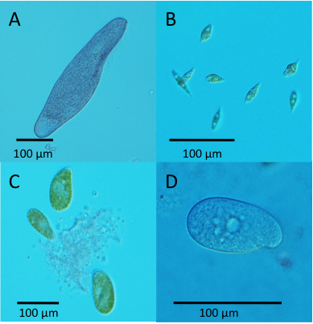

Supplementary information for Altermatt et al. Methods in Ecology and Evolution. DOI: 10.1111/2041-210X.12312

**“Big answers from small worlds: a user's guide for protist microcosms as a model system in ecology and evolution” **

Altermatt F, Fronhofer EA, Garnier A, Giometto A, Hammes F, Klecka J, Legrand D, Mächler E, Massie TM, Pennekamp F, Plebani M, Pontarp M, Schtickzelle N, Thuillier V & Petchey OL

**1.1 Species used**

**Introduction**

Species generally used for protist microcosm experiments cover several major domains of life and a large part of eukaryotic phylogenetic diversity ([Adl *et al.* 2005](#_ENREF_1); [Adl *et al.* 2012](#_ENREF_2)). Generally, and also in the following, the term “protist” covers free-living, unicellular eukaryotes that are not purely autotrophic (Fig. S1). This mostly includes species within the Cryptophyta, Foraminifera, Alveolata, Chloroplastida and Tubulinea (incl. Amoebozoa ([Adl *et al.* 2005](#_ENREF_1); [Adl *et al.* 2012](#_ENREF_2)). Very typical and commonly used representatives are species of the genera *Paramecium*, *Tetrahymena*, and *Colpidium* (all Alveolates, used in \>80 studies), as well as species of the genera *Bodo*, *Colpoda*, *Euplotes* and *Spirostomum* (all used in at least 30–50 studies). These species cover different trophic levels (purely bacterivorous heterotrophs, mixotrophs and predatory heterotrophs feeding also or exclusively on other protists). Table S1 gives a comprehensive list of species that have been used in microcosm experiment studies as discussed here. Many of the methods described in the following are also not restricted to protists, but can (and have been) also applied to single-celled autotrophic species (i.e., algae) or metazoans of similar size and ecological functional (e.g., rotifers).

Fig. S1. Examples of different protist species used in microcosm experiments. A) *Blepharisma* sp., B) *Euglena* *gracilis*, C) *Paramecium* *bursaria*, D) *Colpidium* sp. All pictures by F. Altermatt/R. Illi.

Some of the species used can be cultivated in axenic conditions. However, most of the species thrive better when bacteria (see section 1.3) or microflagellates are present.

The selection of species is often a combination of practical reasons, such as distinctness, cultivability or availability, and the respective question of interest (e.g., functional types or size). All species can in principle be collected directly from natural populations in ponds, phytotelmata or other aquatic habitats (see detailed protocol below). This approach allows the use of co-evolved, potentially genetically diverse populations of natural co-occurring species. However, the difficulties faced during the isolation, cultivation and identification of naturally collected species often preclude this approach. Many studies have thus been based on species either already available in laboratory stocks or commonly available from culture collections. The most commonly used sources to order protist species are:

-   UTEX culture collection of algae, University of Texas, Austin: <http://web.biosci.utexas.edu/utex/media.aspx>

-   Culture Collection of Algae and Protozoa (CCAP), Scottish Marine Institute
    OBAN, Argyll: <http://www.ccap.ac.uk/>

-   American Type Culture Collection, Georgetown University in Washington, DC: <http://www.lgcstandards-atcc.org/en/Products/Cells_and_Microorganisms/Protozoa.aspx>

-   *Tetrahymena* stock center, University of Cornell, Ithaca: <https://tetrahymena.vet.cornell.edu/recipes.php>

-   Scandinavian Culture Collection of Algae and Protozoa, Marine Biological Section, University of Copenhagen, Copenhagen: <http://www.sccap.dk/>

-   Carolina Biological Supply Company, Burlington NC: <http://www.carolina.com/>

-   Sciento Company, Manchester: <http://www.sciento.co.uk>

A difficulty/shortcoming of field collected species/strains is the often imprecise/vague identification of species. Most ecologists and evolutionary ecologists conducting protist microcosm experiments have relatively little taxonomic expertise regarding protists, and thus identifications and naming of species has to be taken with care. A set of identification manuals ([Foissner & Berger 1996](#_ENREF_23); [Lee, Leedale & Bradbury 2000](#_ENREF_56); [Patterson 2003](#_ENREF_71)) as well as genetic barcoding techniques ([Pawlowski *et al.* 2012](#_ENREF_72)), which are nowadays commonly available, should allow an identification at least to the genus level.

The advantage of the use of a common set of species across studies and laboratories is the availability of prior information (such as species traits, Table S2), and the possibility to link findings across studies. In this context, some species from a set of about 20 protist species originally isolated by Peter Morin from a pond at Rutgers University ([McGrady-Steed, Harris & Morin 1997](#_ENREF_64)) have been very widely used across \>50 studies, exemplifying the use of “model organisms” in ecology. The wider range of phylogeny, traits and trophic levels covered allows to select species for specific experiments, e.g., to study predator-prey relationships (e.g., [Holyoak 2000b](#_ENREF_43); [Vasseur & Fox 2009](#_ENREF_85)), compare trait-related relationships across orders of magnitude ([Giometto *et al.* 2013](#_ENREF_37)), or to study how phylogenetic relationships are affecting competitive interactions ([Violle *et al.* 2011](#_ENREF_87)). Importantly, it needs to be considered that A) many trait values are phenotypically plastic and can vary easily within one order of magnitude given the specific experimental conditions. B) protists often do not fall easily into well-defined categories that “higher” organisms do, and that are often used as inspiration for models and concepts to be tested with protists. For example, many protists may switch between different trophic roles, from heterotroph/mixotroph to autotroph (e.g., *Euglena gracilis*) or from autotroph to predatory (e.g., *Paramecium bursaria*). Thus, some of the classifications may be stricter than the actual behaviour/life history of the protists. C) Protists as used here cover the widest phylogenetically range possible within the Eucaryotes ([Adl *et al.* 2012](#_ENREF_2)). Thus, comparisons that include phylogeny as an explanatory variable may be only meaningful within sub-groups (such as Alveolates, see for example Violle *et al.* 2011), as phylogenetic signals across major taxonomic groups may be mostly lost through multiple convergences.

The use of protists in ecology and evolutionary biology can be traced back to Gause ([1934b](#_ENREF_33); [1934a](#_ENREF_32)) and Dallinger ([1878](#_ENREF_15); [1887](#_ENREF_16)), who looked at ecological and evolutionary dynamics respectively. Both of them have been very much inspired by the work of Charles Darwin ([1859](#_ENREF_17)), and are among the first experimental studies testing Darwin’s ideas. In the 1950ies to 1970ies, a whole school of American Ecologists used protist experiments, and especially *Paramecium aurelia*, to address questions of species-coexistence, population dynamics and predator-prey interactions (e.g., [Sonneborn 1950](#_ENREF_81); [Nelson 1958](#_ENREF_67); [Nelson & Kellermann 1965](#_ENREF_69); [Nelson 1967](#_ENREF_68); [Salt 1967](#_ENREF_78); [Gill 1972a](#_ENREF_34); [Gill 1972b](#_ENREF_35); [Gill & Nelson 1972](#_ENREF_36); [Vandermeer *et al.* 1972](#_ENREF_84); [Luckinbill 1973](#_ENREF_59); [Luckinbill 1974](#_ENREF_60); [Luckinbill & Fenton 1978](#_ENREF_62); [Luckinbill 1979](#_ENREF_61); [Veilleux 1979](#_ENREF_86)). This work was later on revived, especially by Peter Morin and colleagues (e.g., [Lawler & Morin 1993](#_ENREF_55); [McGrady-Steed, Harris & Morin 1997](#_ENREF_64); [Petchey *et al.* 1999](#_ENREF_77); [McGrady-Steed & Morin 2000](#_ENREF_65); [Fox & Morin 2001](#_ENREF_25); [Fukami & Morin 2003](#_ENREF_31); [Jiang & Morin 2004](#_ENREF_47); [Morin & McGrady-Steed 2004](#_ENREF_66); [Jiang & Morin 2005](#_ENREF_48); [Steiner *et al.* 2006](#_ENREF_82)). It has been ever since used by a growing number of ecologists and evolutionary biologists (e.g., [Lawler & Morin 1993](#_ENREF_55); [Warren 1996b](#_ENREF_90); [Warren 1996a](#_ENREF_89); [Fox & Smith 1997](#_ENREF_26); [Petchey *et al.* 1999](#_ENREF_77); [Fox, McGrady-Steed & Petchey 2000](#_ENREF_24); [Holyoak 2000b](#_ENREF_43); [Holyoak 2000a](#_ENREF_42); [Petchey 2000](#_ENREF_75); [Fukami 2001](#_ENREF_30); [Donahue, Holyoak & Feng 2003](#_ENREF_19); [Kneitel & Miller 2003](#_ENREF_51); [Laakso, Loytynoja & Kaitala 2003](#_ENREF_54); [Jiang & Kulczycki 2004](#_ENREF_46); [Kneitel & Chase 2004](#_ENREF_50); [Holyoak & Lawler 2005](#_ENREF_45); [Cadotte *et al.* 2006](#_ENREF_8); [Östman, Kneitel & Chase 2006](#_ENREF_70); [Cadotte 2007b](#_ENREF_7); [Fjerdingstad *et al.* 2007](#_ENREF_22); [Friman *et al.* 2008](#_ENREF_28); [Haddad *et al.* 2008](#_ENREF_39); [Jiang & Patel 2008](#_ENREF_49); [Davies *et al.* 2009](#_ENREF_18); [Schtickzelle *et al.* 2009](#_ENREF_79); [Worsfold, Warren & Petchey 2009](#_ENREF_91); [Chaine *et al.* 2010](#_ENREF_11); [Hammill, Petchey & Anholt 2010](#_ENREF_40); [Petchey, Brose & Rall 2010](#_ENREF_76); [TerHorst 2010](#_ENREF_83); [Violle, Pu & Jiang 2010](#_ENREF_88); [Altermatt *et al.* 2011](#_ENREF_3); [Altermatt, Schreiber & Holyoak 2011](#_ENREF_5); [Friman & Laakso 2011](#_ENREF_27); [Limberger & Wickham 2011](#_ENREF_57); [Violle *et al.* 2011](#_ENREF_87); [Altermatt & Holyoak 2012](#_ENREF_4); [Carrara *et al.* 2012](#_ENREF_9); [Limberger & Wickham 2012](#_ENREF_58); [Mächler & Altermatt 2012](#_ENREF_63); [Clements *et al.* 2013a](#_ENREF_13); [Clements *et al.* 2013b](#_ENREF_14); [Giometto *et al.* 2013](#_ENREF_37); [Pennekamp & Schtickzelle 2013](#_ENREF_74); [Carrara *et al.* 2014](#_ENREF_10); [Clements *et al.* 2014](#_ENREF_12); [Fronhofer, Kropf & Altermatt 2014](#_ENREF_29); [Giometto *et al.* 2014](#_ENREF_38); [Pennekamp *et al.* 2014](#_ENREF_73); [Seymour & Altermatt 2014](#_ENREF_80)), and the types of questions addressed diversified extensively. Research areas now include the phylogenetic limiting similarity hypothesis ([e.g., Violle, Pu & Jiang 2010](#_ENREF_88)), effects of disturbance and productivity on diversity (e.g., [Haddad *et al.* 2008](#_ENREF_39); [Altermatt, Schreiber & Holyoak 2011](#_ENREF_5)), the significance of trade-offs (e.g., [Cadotte 2007a](#_ENREF_6); [Violle, Pu & Jiang 2010](#_ENREF_88)), synchrony in population dynamics ([e.g., Vasseur & Fox 2009](#_ENREF_85)), effects of environmental change on food web structure and species interactions (e.g., [Petchey *et al.* 1999](#_ENREF_77); [Fox & Morin 2001](#_ENREF_25)), the study of predator-prey interactions and inducible defences ([Kratina *et al.* 2009](#_ENREF_53); [Kratina, Hammill & Anholt 2010](#_ENREF_52)), the regulatory effects of biodiversity on ecosystem processes ([e.g., McGrady-Steed, Harris & Morin 1997](#_ENREF_64)), invasion dynamics (e.g., [Mächler & Altermatt 2012](#_ENREF_63); [Giometto *et al.* 2014](#_ENREF_38)), the significance of spatial dynamics on diversity and species interactions (e.g., [Holyoak & Lawler 1996](#_ENREF_44); [Carrara *et al.* 2012](#_ENREF_9)), scaling laws in ecology (e.g., [Fenchel 1974](#_ENREF_21); [Giometto *et al.* 2013](#_ENREF_37)), epidemiological dynamics ([e.g., Fellous *et al.* 2012](#_ENREF_20)) and evolutionary and eco-evolutionary dynamics (e.g., [Dallinger 1887](#_ENREF_16); [Schtickzelle *et al.* 2009](#_ENREF_79); [Hiltunen *et al.* 2014](#_ENREF_41)).

Table S1. List of species used in protist microcosm experiments (alphabetically sorted from higher to lower taxonomic levels). The name of each species as well as its higher and lower taxonomic classification (after Adl et al. 2012) is given. For each species, we give one or few representative references of studies that have been using it. SAR is a clade including the groups Stramenopiles, Alveolata, and Rhizaria.

| **Species name**                  | **Higher taxonomic group ** | **Lower taxonomic group** | **Reference examples**                                                                                                    |
|-----------------------------------|-----------------------------|---------------------------|---------------------------------------------------------------------------------------------------------------------------|
| *Adercotryma glomerata*           | SAR                         | Foraminifera              | Gross 2000                                                                                                                |
| *Allogromia sp.*                  | SAR                         | Foraminifera              | Gross 2000                                                                                                                |
| *Ammonia beccarii*                | SAR                         | Foraminifera              | Gross 2000                                                                                                                |
| *Ammoscalaria pseudospiralis*     | SAR                         | Foraminifera              | Gross 2000                                                                                                                |
| *Amoeba proteus*                  | Amoebozoa                   | Tubulinea                 | Davies et al. 2009, Holt et al. 2002, Holyoak 2000, Lawler & Morin 1993, Livingston et al. 2013, Naeem & Li 1998          |
| *Amoeba radiosa*                  | Amoebozoa                   | Tubulinea                 | Östman et al. 2006, Fox et al 2000, Krumins et al, 2006                                                                   |
| *Amphicoryna scalaris*            | SAR                         | Foraminifera              | Gross 2000                                                                                                                |
| *Ankistrodesmus falcatus*         | Archaeplastida              | Chloroplastida            | Jin et al. 1991, McGrady-Steed et al. 1997 (genus), Davies et al. 2009 (genus), Fox et al. 2000 (genus)                   |
| *Arcella vulgaris*                | Amoebozoa                   | Tubulinea                 | Li & Stevens 2010 Oikos, Li & Stevens 2010 CommEcol                                                                       |
| *Askenasia sp.*                   | SAR                         | Alveolata                 | Lawler 1993, McGrady-Steed & Morin 1996                                                                                   |
| *Aspidisca sp.*                   | SAR                         | Alveolata                 | Fox et al 2000, Kneitel & Perrault 2006, McGrady-Steed & Morin 2000, Warren et al. 2003                                   |
| *Asterionella formosa*            | SAR                         | Stramenopiles             | Fox 2004, Robinson & Edgemon 1998 (genus)                                                                                 |
| *Atractomorpha echinata*          | Archaeplastida              | Chloroplastida            | Livingston et al. 2013                                                                                                    |
| *Bigenerina nodosaria*            | SAR                         | Foraminifera              | Gross 2000                                                                                                                |
| *Blepharisma americanum*          | SAR                         | Alveolata                 | Fox & Morin 2001, Holyoak 2000, Krumins et al. 2006, Livingston et al. 2013, Olito & Fukami 2009                          |
| *Blepharisma japonicum*           | SAR                         | Alveolata                 | Clements et al. 2013 JAnim Ecol, Holt et al. 2004, Law et al. 2000, Spencer & Warren 1996 Oecologia, Weatherby et al 1998 |
| *Bodo designis*                   | Excavata                    | Discoba                   | Fitter & Hillebrand 2009, Burkey 1997 (genus), Cochran-Strafira & von Ende 1998 (genus), Scarff & Bradley 2002 (genus)    |
| *Bodo saltans*                    | Excavata                    | Discoba                   | Giometto et al 2013, Jürgens & Sala 2000, Kneitel & Perrault 2006, Östman et al. 2006                                     |
| *Boldia erythrosiphon*            | Archaeplastida              | Rhodophyceae              | Livingston et al. 2013                                                                                                    |
| *Bulimina marginata*              | SAR                         | Foraminifera              | Gross 2000                                                                                                                |
| *Campylomonas reflexa *           | Cryptophyta                 | Cryptophyta               | Livingston et al. 2013                                                                                                    |
| *Cassidulina leavigata*           | SAR                         | Foraminifera              | Gross 2000                                                                                                                |
| *Chilomonas paramecium*           | Cryptophyta                 | Cryptophyta               | Balciunas & Lawler 1995, Burkey 1997, Holt et al. 2004, Naeem & Li 1998, Warren & Gaston 1997, Scholes et al. 2005        |
| *Chilomonas spp.*                 | Cryptophyta                 | Cryptophyta               | Giometto et al. 2013 PNAS, McGrady-Steed et al. 1997, Davies et al. 2009, Fox et al. 2000, Robinson & Dickerson 1987      |
| *Chlamydomonas microsphaera*      | Archaeplastida              | Chloroplastida            | Jin et al. 1991                                                                                                           |
| *Chlamydomonas moewusii *         | Archaeplastida              | Chloroplastida            | Dickerson & Robinson 1985, Dickerson & Robinson 1986                                                                      |
| *Chlamydomonas noctigama*         | Archaeplastida              | Chloroplastida            | Rboinson & Edgemon 1988                                                                                                   |
| *Chlamydomonas reinhadrtii*       | Archaeplastida              | Chloroplastida            | Fox & Olson 2000, Fox 2004, Livingston et al. 2013, Naeem & Li 1998                                                       |
| *Chlamydomonas terricola*         | Archaeplastida              | Chloroplastida            | Filip et al. 2012                                                                                                         |
| *Chlorella autotrophica*          | Archaeplastida              | Chloroplastida            | Hiltunen et al. 2013, Fox 2008 (genus), Hulot et al. 2001 (genus), Kurihara 1978 (genus), Li & Stevens 2012 (genus)       |
| *Chlorella pyrenoidosa*           | Archaeplastida              | Chloroplastida            | Jin et al. 1991                                                                                                           |
| *Chlorella vulgaris*              | Archaeplastida              | Chloroplastida            | Fox 2004, Mueller et al. 2012, Nakajima et al. 2009                                                                       |
| *Chlorogonium euchlorum*          | Archaeplastida              | Chloroplastida            | Giometto et al. 2013                                                                                                      |
| *Chlorokybus atmophyticus *       | Archaeplastida              | Chloroplastida            | Livingston et al. 2013                                                                                                    |
| *Chloromonas clathrata*           | Archaeplastida              | Chloroplastida            | Livingston et al. 2013                                                                                                    |
| *Chroomonas pochmanii*            | Cryptophyta                 | Cryptophyta               | Livingston et al. 2013                                                                                                    |
| *Chrysopsis sp.*                  | Archaeplastida              | Glaucophyta               | Krumins et al. 2006                                                                                                       |
| *Cibicidoides flordanus*          | SAR                         | Foraminifera              | Gross 2000                                                                                                                |
| *Closterium acerosum*             | Archaeplastida              | Chloroplastida            | Livingston et al. 2013, Robinson & Edgemon 1988 (genus)                                                                   |
| *Closterium libellula*            | Archaeplastida              | Chloroplastida            | Li & Stevens 2010 Oikos, Li & Stevens 2010 CommEcol                                                                       |
| *Colacium vesiculosum *           | Excavata                    | Discoba                   | Livingston et al. 2013, Cadotte et al. 2006 (genus),                                                                      |
| *Coleps hirtus*                   | SAR                         | Alveolata                 | Have 1993, Cadotte et al. 2006 (genus), Fukami 2004 (genus), Mata et al. 2013 (genus)                                     |
| *Collodictyon triciliatum*        | Collodictyonidae            | Collodictyonidae          | Petchey 2000                                                                                                              |
| *Colpidium campylum*              | SAR                         | Alveolata                 | Have 1990, Luckinbill & Fenton 1978, Östman et al. 2006                                                                   |
| *Colpidium cf. striatum*          | SAR                         | Alveolata                 | Balciunas & Lawler 1995, Holyoak & Lawler 1996 Ecology                                                                    |
| *Colpidium colpidium*             | SAR                         | Alveolata                 | Scholes et al. 2005                                                                                                       |
| *Colpidium colpoda*               | SAR                         | Alveolata                 | Have 1993                                                                                                                 |
| *Colpidium kleini*                | SAR                         | Alveolata                 | Jiang & Patel 1993, Livingston et al. 2013, Violle et al. 2010                                                            |
| *Colpidium striatum*              | SAR                         | Alveolata                 | Cadotte & Fukami 2005, Fox & Barreto 2006, Jiang & Morin 2005, Leary & Petchy 2009, Warren & Weatherby 2006               |
| *Colpoda cucullus*                | SAR                         | Alveolata                 | Bretthauer 1980, Fukami 2004, Jiang & Morin 2005, Krumins et al. 2006                                                     |
| *Colpoda inflata*                 | SAR                         | Alveolata                 | Cadotte & Fukami 2005, Krumins et al. 2006, Steiner 2005                                                                  |
| *Condylostoma sp.*                | SAR                         | Alveolata                 | Warren 1996 Oikos                                                                                                         |
| *Cosmarium sportella*             | Archaeplastida              | Chloroplastida            | Li & Stevens 2010 Oikos, Li & Stevens 2012, Robinson & Edgemon 1988 (genus)                                               |
| *Cryptomonas curvata *            | Cryptophyta                 | Cryptophyta               | Giometto et al. 2013, Filip et al. 2012 (genus)                                                                           |
| *Cryptomonas erosa*               | Cryptophyta                 | Cryptophyta               | Livingston et al. 2013                                                                                                    |
| *Cryptomonas ovata*               | Cryptophyta                 | Cryptophyta               | Bretthauer 1980, Elstad 1986, Fox 2004, Östman et al. 2006                                                                |
| *Crytolophosis sp.*               | SAR                         | Alveolata                 | Fukami 2001                                                                                                               |
| *Cyclidium glaucoma*              | SAR                         | Alveolata                 | Giometto et al. 2013, Fox 2007, Davies et al. 2009 (genus), Kneitel & Perrault 2006 (genus)                               |
| *Cyclotella sp.*                  | SAR                         | Stramenopiles             | Krumins et al. 2006                                                                                                       |
| *Dexiostoma campylum *            | SAR                         | Alveolata                 | Giometto et al. 2013, Riblett et al. 2003                                                                                 |
| *Dictyosphaerium planctonicum*    | Archaeplastida              | Chloroplastida            | Dickerson & Robinson 1985, Dickerson & Edgemon 1988                                                                       |
| *Didinium nasutum*                | SAR                         | Alveolata                 | Veilleux 1979, Holyoak & Sachdev 1998, Luckinbill 1979, Warren 1996 Oikos                                                 |
| *Dileptus anser*                  | SAR                         | Alveolata                 | Davies et al. 2009, Petchey 2000                                                                                          |
| *Dileptus monilatus*              | SAR                         | Alveolata                 | Jiang et al. 2011, Livingston et al. 2013                                                                                 |
| *Dinobryon cylindricum*           | Archaeplastida              | Chloroplastida            | Dickerson & Robinson 1986, Robinson & Edgemon 1988                                                                        |
| *Entosiphon sulcatum*             | Excavata                    | Discoba                   | Fitter & Hillebrand 2009, Holt et al. 2004 (genus), Scholes et al. 2005 (genus), Warren & Weatherby 2006 (genus)          |
| *Eremosphaera viridis*            | Archaeplastida              | Chloroplastida            | Robinson & Edgemon 1988                                                                                                   |
| *Eudorina elegans*                | Archaeplastida              | Chloroplastida            | Dickerson & Robinson 1985                                                                                                 |
| *Euglena gracilis *               | Excavata                    | Discoba                   | Altermatt & Holyoak 2012, Davies et al. 2009, Dickerson & Robinson 1985, Kawambata et al. 1995                            |
| *Euglena mutabilis *              | Excavata                    | Discoba                   | Giometto et al. 2013                                                                                                      |
| *Euplotes aediculatus *           | SAR                         | Alveolata                 | Altwegg et al. 2004, Carrara et al. 2012, Jiang & Morin 2005, Kratina et al. 2007                                         |
| *Euplotes affinis*                | SAR                         | Alveolata                 | Bretthauer 1980                                                                                                           |
| *Euplotes cf. eurystomus*         | SAR                         | Alveolata                 | Mata et al. 2013                                                                                                          |
| *Euplotes daidaleos*              | SAR                         | Alveolata                 | Filip et al. 2012                                                                                                         |
| *Euplotes eurystomus*             | SAR                         | Alveolata                 | Li & Stevens 2010 Oikos, Li & Stevens 2012, Naeem & Li 1998                                                               |
| *Euplotes octocarinatus*          | SAR                         | Alveolata                 | Altwegg et al. 2004                                                                                                       |
| *Euplotes patella*                | SAR                         | Alveolata                 | Balciunas & Lawler 1995, Fox et al. 2013, Holyoak & Sachdev 1998, Spencer & Warren 1996 Oecologia                         |
| *Euplotes plumipes*               | SAR                         | Alveolata                 | Altwegg et al. 2004                                                                                                       |
| *Euplotes surystomus*             | SAR                         | Alveolata                 | Li & Stevens 2010 CommEcol                                                                                                |
| *Fragilaria capucina*             | SAR                         | Stramenopiles             | Filip et al. 2012, Fitter & Hillebrand 2009                                                                               |
| *Frontonia angusta*               | SAR                         | Alveolata                 | Filip et al. 2012, McGrady-Steed et al. 1997 (genus), Fox et al. 2000 (genus), Have 1993 (genus)                          |
| *Gavelinopsis praegeri*           | SAR                         | Foraminifera              | Gross 2000                                                                                                                |
| *Gavelinopsis translucens*        | SAR                         | Foraminifera              | Gross 2000                                                                                                                |
| *Glaucoma myriophylli*            | SAR                         | Alveolata                 | Bretthauer 1980                                                                                                           |
| *Glaucoma scintillans*            | SAR                         | Alveolata                 | Have 1990, Livingston er al. 2013, Violle et al. 2011                                                                     |
| *Glaucoma sp.*                    | SAR                         | Alveolata                 | Jiang & Patel 2008                                                                                                        |
| *Globobulimina affinis*           | SAR                         | Foraminifera              | Gross 2000                                                                                                                |
| *Globocassidulina subglobosa*     | SAR                         | Foraminifera              | Gross 2000                                                                                                                |
| *Gonium pectorale*                | Archaeplastida              | Chloroplastida            | Dickerson & Robinson 1985, Dickerson & Robinson 1986                                                                      |
| *Haematococcus lacustris*         | Archaeplastida              | Chloroplastida            | Fox 2004, Livingston et al. 2013                                                                                          |
| *Halteria grandinella*            | SAR                         | Alveolata                 | Have 1993, Jiang et al. 2009, Livingston et al. 2013, Violle et al. 2010,                                                 |
| *Heliozoa sp. *                   | SAR                         | Chromista                 | McGrady-Steed et al. 1997 (genus), Davies et al. 2009, Fox et al. 2000                                                    |
| *Keronopsis sp.*                  | SAR                         | Alveolata                 | Have 1993                                                                                                                 |
| *Lacrymaria olor*                 | SAR                         | Alveolata                 | Have 1993, Jiang et al. 2009, Cadotte & Fukami 2005 (genus)                                                               |
| *Lenticulina cultrata*            | SAR                         | Foraminifera              | Gross 2000                                                                                                                |
| *Leptopharynx sp.*                | SAR                         | Alveolata                 | Fukami 2001                                                                                                               |
| *Litonotus sp.*                   | SAR                         | Alveolata                 | Östman et al. 2006                                                                                                        |
| *Loxocephalus simplex*            | SAR                         | Alveolata                 | Have 1990, Clements et al. 2013 JAnimEcol (genus), Jiang & Morin 2005 (genus), Steiner 2005 (genus)                       |
| *Loxophyllum helus*               | SAR                         | Alveolata                 | Have 1993                                                                                                                 |
| *Mallomonas caudata*              | SAR                         | Stramenopiles             | Robinson & Edgemon 1988                                                                                                   |
| *Mayorella sp.*                   | Amoebozoa                   | Tubulinea                 | Kneitel & Perrault 2006 (genus)                                                                                           |
| *Micrasterias rotata*             | Archaeplastida              | Chloroplastida            | Li & Stevens 2010 CommEcol                                                                                                |
| *Monas sp.*                       | SAR                         | Chromista                 | Bretthauer 1980                                                                                                           |
| *Nassula sorex*                   | SAR                         | Alveolata                 | Filip et al. 2012                                                                                                         |
| *Navicula pelliculosa*            | Archaeplastida              | Stramenopiles             | Filip et al. 2012, Limberger & Wickham 2011 PLoSOne, Limberger & Wickham 2010                                             |
| *Netrium sp.*                     | Archaeplastida              | Chloroplastida            | Fox et al. 2000, McGrady-Steed et al. 1997, McGrady-Steed & Morin 2000                                                    |
| *Nitzschia sp.*                   | Archaeplastida              | Chloroplastida            | Fitter & Hildebrand 2009, Jin et al. 1991, Robinson & Edgemon 1988                                                        |
| *Nonion commune*                  | SAR                         | Foraminifera              | Gross 2000                                                                                                                |
| *Ochromonas danica*               | Archaeplastida              | Stramenopiles             | Dickerson & Robinson 1985, Dickerson & Robinson 1986, Robinson & Edgemon 1988                                             |
| *Ochromonas sociabilis*           | Archaeplastida              | Stramenopiles             | Bretthauer 1980                                                                                                           |
| *Onychodromopsis flexilis*        | SAR                         | Alveolata                 | Limberger & Wickham 2011 Oecologia, Limberger & Wickham 2012                                                              |
| *Oocystis apiculata*              | Archaeplastida              | Chloroplastida            | Robinson & Edgemon 1988                                                                                                   |
| *Ophiocytium maius*               | SAR                         | Stramenopiles             | Robinson & Edgemon 1988                                                                                                   |
| *Oxyrrhis marina*                 | SAR                         | Alveolata                 | Hiltunen et al. 2013                                                                                                      |
| *Oxytricha sp.*                   | SAR                         | Alveolata                 | Fox et al. 2000, Krumins et al. 2006                                                                                      |
| *Pandorina morum*                 | Archaeplastida              | Chloroplastida            | Li & Stevens 2010 CommEcol, Robinson & Edgemon 1988                                                                       |
| *Paradileptus sp.*                | SAR                         | Alveolata                 | Have 1993                                                                                                                 |
| *Paramecium aurelia*              | SAR                         | Alveolata                 | DeLong & Vasseur 2012, Fox 2008, Luckinbill 1973, Petchey 2000                                                            |
| *Paramecium bursaria *            | SAR                         | Alveolata                 | Altermatt et al. 2011, Cadotte 2006 Ecol, Vandermeer 1969, Violle et al 2011 EcoLet                                       |
| *Paramecium caudatum*             | SAR                         | Alveolata                 | Fellous et al. 2012 PLoSOne, Duncan et al. 2011, Fels et al. 2008, Lunn et al. 2013                                       |
| *Paramecium multimicronucleatum*  | SAR                         | Alveolata                 | Dickerson & Robinson 1986, Naeem & Li 1998, Robinson & Dickerson 1987                                                     |
| *Paramecium primaurelia*          | SAR                         | Alveolata                 | Luckinbill & Fenton 1978, Luckinbill 1979 AmNat                                                                           |
| *Paramecium tetraurelia*          | SAR                         | Alveolata                 | Cohen et al. 1998, Gonzales & Holt 2002, Jiang & Kulcycki 2004, Long & Karel 2002                                         |
| *Paramecium trichium*             | SAR                         | Alveolata                 | Östman et al. 2006                                                                                                        |
| *Pediastrum sp.*                  | Archaeplastida              | Chloroplastida            | Livingston et al. 2013, Robinson & Edgemon 1988                                                                           |
| *Pelomyxa carolinensis*           | Amoebozoa                   | Archamoebae               | Naeem & Li 1998                                                                                                           |
| *Peranema trichophorum*           | Excavata                    | Discoba                   | Spencer & Warren 1996 Oikos                                                                                               |
| *Peridinium cinctum f. ovoplanum* | SAR                         | Alveolata                 | Dickerson & Robinson 1985, Fox 2008 (genus), Robinson & Edgemon 1988 (genus)                                              |
| *Petalomonas sp.*                 | Excavata                    | Discoba                   | Spencer & Warren 1996 Oikos                                                                                               |
| *Phacus sp.*                      | Excavata                    | Discoba                   | Fox et al. 2000                                                                                                           |
| *Planorbulina mediterranensis*    | SAR                         | Foraminifera              | Gross 2000                                                                                                                |
| *Platydorina sp.*                 | Archaeplastida              | Chloroplastida            | Dickerson & Robinson 1985                                                                                                 |
| *Pleodorina californica*          | Archaeplastida              | Chloroplastida            | Livingston et al. 2013                                                                                                    |
| *Polytomella sp.*                 | Archaeplastida              | Chloroplastida            | Kneitel & Perrault 2006                                                                                                   |
| *Poterioochromonas malhamensis*   | SAR                         | Stramenopiles             | Kadowaki et al. 2012, Saleem et al. 2012 (genus), Saleem et al. 2013 (genus)                                              |
| *Poterioochromonas stipitata*     | SAR                         | Stramenopiles             | Östman et al. 2006                                                                                                        |
| *Pseudocyrtolophosis alpestris*   | SAR                         | Alveolata                 | terHorst 2010 AmNat, terHorst 2010 JEB                                                                                    |
| *Pyrgo murrhina*                  | SAR                         | Rhizaria                  | Gross 2000                                                                                                                |
| *Quuinequeloculina lamarckiana*   | SAR                         | Foraminifera              | Gross 2000                                                                                                                |
| *Rhynchomonas nasuta*             | Excavata                    | Discoba                   | Fitter & Hillebrand 2009                                                                                                  |
| *Rosalina cf. bardyi*             | SAR                         | Rhizaria                  | Gross 2000                                                                                                                |
| *Rubrioxytricha ferruginea*       | SAR                         | Alveolata                 | Limberger & Wickham 2011 Oecologia                                                                                        |
| *Saccammina sp.*                  | SAR                         | Foraminifera              | Gross 2000                                                                                                                |
| *Scenedesmus gladiosum*           | Archaeplastida              | Chloroplastida            | Livingston et al. 2013                                                                                                    |
| *Scenedesmus obliquus*            | Archaeplastida              | Chloroplastida            | Jin et al. 1991                                                                                                           |
| *Scenedesmus opoliensis*          | Archaeplastida              | Chloroplastida            | Li & Stevens 2010 ComEcol, Li & Stevens 2010 Oikos, Li & Stevens 2012                                                     |
| *Scenedesmus quadricauda*         | Archaeplastida              | Chloroplastida            | Dickerson & Robinson 1985, Dickerson & Robinson 1986, Robinson & Edgemon 1988                                             |
| *Selenastrum capricornutum*       | Archaeplastida              | Chloroplastida            | Jin et al. 1991                                                                                                           |
| *Sellaphora pupula*               | SAR                         | Stramenopiles             | Livingston et al. 2013                                                                                                    |
| *Spathidium sp.*                  | SAR                         | Alveolata                 | Fukami 2001, McGrady-Steed & Morin 1996                                                                                   |
| *Sphaerocystis schroeteri*        | Archaeplastida              | Chloroplastida            | Robinson & Edgemon 1988                                                                                                   |
| *Spirogyra occidentalis *         | Archaeplastida              | Chloroplastida            | Livingston et al. 2013, Robinson & Edgemon 1988 (genus)                                                                   |
| *Spiroplectinella wrightii*       | SAR                         | Foraminifera              | Gross 2000                                                                                                                |
| *Spirostomum ambiguum*            | SAR                         | Alveolata                 | Have 1990, Kratina et al. 2007, Krumins et al. 2006, Naeem & Li 1998, Spencer & Warreb 1996 Oikos                         |
| *Spirostomum teres*               | SAR                         | Alveolata                 | Holt et al. 2004, Violle et al. 2011, Warren & Gaston 1997                                                                |
| *Spumella sp.*                    | Archaeplastida              | Chloroplastida            | Jürgens & Sala 2000, Riblett et al. 2008                                                                                  |
| *Staurastrum gladiosum*           | Archaeplastida              | Chloroplastida            | Livingston et al. 2013, McGrady-Steed et al.1997 (genus), Davies et al. 2009 (genus), Fox 2008 (genus)                    |
| *Staurastrum pingue*              | Archaeplastida              | Chloroplastida            | Robinson & Edgemon 1988                                                                                                   |
| *Steinia sp.*                     | SAR                         | Alveolata                 | Lawler 1993                                                                                                               |
| *Stentor coeruleus*               | SAR                         | Alveolata                 | Bretthauer 1980, Cadotte & Fukami 2005, Jiang & Morin 2005, Spencer & Warren 1996 Oecologia                               |
| *Stentor polymorphus*             | SAR                         | Alveolata                 | Have1993, Östman et al. 2006                                                                                              |
| *Stephanodiscus sp.*              | SAR                         | Stramenopiles             | Robinson & Edgemon 1988                                                                                                   |
| *Stichococcus sp.*                | Archaeplastida              | Chloroplastida            | Scraff & Bradley 2002                                                                                                     |
| *Stigeoclonium sp.*               | Archaeplastida              | Chloroplastida            | Jin et al. 1991                                                                                                           |
| *Stylonychia mytilus*             | SAR                         | Alveolata                 | Bretthauer 1980, Fox et al. 2000 (genus), McGrady-Steed et al. 1997 (genus), Filip et al. 2009 (genus)                    |
| *Stylonychia pustulata*           | SAR                         | Alveolata                 | Limberger & Wickham 2012 Oecologia, Limberger & Wickham 2011 PLoSOne                                                      |
| *Suctoria sp.*                    | SAR                         | Alveolata                 | Fukami 2001                                                                                                               |
| *Synedra sp.*                     | SAR                         | Stramenopiles             | Robinson & Edgemon 1988                                                                                                   |
| *Synura sp.*                      | SAR                         | Stramenopiles             | Robinson & Edgemon 1988                                                                                                   |
| *Tachysoma pellionellum*          | SAR                         | Alveolata                 | Östman et al. 2006, Limberger & Wickham 2012 PLoSOne, McGrady-Steed & Morin 1996 (genus)                                  |
| *Tetrahymena pyriformis*          | SAR                         | Alveolata                 | Amezuca & Holyoak 2000, Glaser 1988, Olito & Fukami 2009, Vasseur & Fox 2009                                              |
| *Tetrahymena thermophila *        | SAR                         | Alveolata                 | Fjerdingstad et al. 2008, Fryxell et al. 2005, Chaine et al. 2009, Laakso et al. 2003, Nakajima et al. 2009               |
| *Tetrahymena vorax*               | SAR                         | Alveolata                 | Fox 2008, Holyoak & Sachdev 1998, Jiang & Patel 2008, Livingston et al. 2013                                              |
| *Textularia porrecta*             | SAR                         | Rhizaria                  | Gross 2000                                                                                                                |
| *Tillina magna*                   | SAR                         | Alveolata                 | Scholes et al. 2005, Warren & Weatherby 2006, Holt et al. 2004 (genus), McGrady-Steed & Morin 1996 (genus)                |
| *Trachelomonas grandis*           | Excavata                    | Discoba                   | Dickerson & Robinson 1985, Dickerson & Robinson 1986                                                                      |
| *Trachelomonas hispida*           | Excavata                    | Discoba                   | Robinson & Edgemon 1988, Robinson & Dickerson 1987 (genus)                                                                |
| *Trochammina shannoni*            | SAR                         | Rhizaria                  | Gross 2000                                                                                                                |
| *Urocentrum turbo*                | SAR                         | Alveolata                 | Have 1993                                                                                                                 |
| *Uroleptus sp.*                   | SAR                         | Alveolata                 | Kneitel & Perrault 2006                                                                                                   |
| *Uronema sp.*                     | Archaeplastida              | Chloroplastida            | Cadotte 2006, Kuppardt et al. 2010, Lawler 1993, Livingston et al. 2013                                                   |
| *Urostyla grandis*                | SAR                         | Alveolata                 | Limberger & Wickham 2012 PLoSOne, Fox et al. 2000 (genus), Lawler 1993 (genus)                                            |
| *Uvigerina mediterranea*          | SAR                         | Foraminifera              | Gross 2000                                                                                                                |
| *Vischeria helvetica*             | SAR                         | Stramenopiles             | Livingston et al. 2013                                                                                                    |
| *Volvox aureus*                   | Archaeplastida              | Chloroplastida            | Li & Stevens 2012 Oikos, Robinson & Edgemon 1988                                                                          |
| *Volvox carteri*                  | Archaeplastida              | Chloroplastida            | Li & Stevens 2010 CommEcol, Li & Stevens 2010 Oikos                                                                       |
| *Volvox rousseletti*              | Archaeplastida              | Chloroplastida            | Livingston et al. 2013                                                                                                    |
| *Vorticella campanula*            | SAR                         | Alveolata                 | Ollason 1977, Fox 2008 (genus), Fukami 2001 (genus), Kneitel & Perrault 2006 (genus)                                      |
| *Vorticella convallaria*          | SAR                         | Alveolata                 | Ollason 1977                                                                                                              |
| *Vorticella microstoma*           | SAR                         | Alveolata                 | Östman et al. 2006                                                                                                        |
| *Vorticella similis*              | SAR                         | Alveolata                 | Spencer & Warren 1996 Oikos                                                                                               |
| *Zygnema circumcarinatum *        | Archaeplastida              | Chloroplastida            | Livingston et al. 2013                                                                                                    |

Table S2. Overview on traits of some of the most commonly used species. The trait measurements for individual species may depend on the specific experimental conditions (e.g., temperature and nutrient levels affecting both growth rates as well as size). This table, however, is mostly aiming at showing overall patterns in traits and exemplifying the range of trait values (often over orders of magnitudes). The original source of the trait value is given for each trait. Size gives the diameter. If not indicated differently, trait values on size, growth rate and carrying capacity are from Carrara et al. 2012, and velocity is from Altermatt et al. 2012. When possible, mean and ±standard deviations of trait values are given.

| **Species name **              | **Size (µm)** | **Growth rate r (1/d)** | **Carrying capacity K (Ind/ml)** | **Velocity (µm/s)** | **Trophic status** |
|--------------------------------|---------------|-------------------------|----------------------------------|---------------------|--------------------|
| *Blepharisma* sp.              | 471.3 ± 57.1  | 0.67 ± 0.07             | 59.5 ± 4.7                       |                     | predator           |
| *Chilomonas* sp.               | 23.3 ± 3.7    | 0.98 ± 0.13             | 1572.4 ± 278.3                   | 168.1               | heterotroph        |
| *Colpidium* sp.                | 81 ± 7.8      | 1.5 ± 0.08              | 1379.2 ± 76.6                    | 470.2               | heterotroph        |
| *Euglena gracilis*             | 36.7 ± 6.4\*  | 0.87\*                  | 84578\*                          | 69.1                | mixotroph          |
| *Euplotes aediculatus*         | 85.4 ± 8.6\*  | 0.43\*                  | 359\*                            | 591.9               | mixotroph          |
| *Paramecium* *aurelia*         | 111.6 ± 15.1  | 0.86 ± 0.02             | 111.1 ± 2.6                      | 1280.8              | heterotroph        |
| *Paramecium bursaria*          | 101.3 ± 12.9  | 0.23                    | 1639                             | 1090.2              | mixotroph          |
| *Spirostomum* sp.              | 843.8 ± 149.7 | 0.57 ± 0.15             | 13.6 ± 4.2                       | 418.2               | heterotroph        |
| *Tetrahymena* cf. *pyriformis* | 26.7 ± 4.8    | 2.24 ± 0.15             | 2996.8 ± 196.1                   | 148.8               | heterotroph        |

\* data from Haddad et al. 2008

**Materials**

***Equipment***

For the isolation of protists the following equipment is needed:

-   Stereomicroscope (see section 2.2) and general apparatus for cultivation (section 1.4).

-   Sterile petri dishes.

-   Sterile capillary glass-pipettes (glass Pasteur pipettes with latex bulbs).

***Reagents***

-   Autoclaved and bacterized culture medium (see section 1.2).

-   80% Ethanol for sterilizing surfaces and equipment.

**Procedure**

The following procedure is for isolating species from natural communities or from species purchased from culture collections that are not pure:

1.  Collect a water sample (100–200 mL) from the natural source of interest (pond, tree hole, pitcher plant etc.).

2.  Bring the sample as quickly as possible to the laboratory, avoid warming of the sample (store and transport it in a cooler box at 10°C) and avoid strong exposition to sunlight.

3.  Take a subsample of about 5 mL into a petri dish, dilute with 10 mL of the chosen culture medium, in order acclimate the species to the new osmotic conditions and to dilute densities of the protists.

4.  Separately place five 0.5 mL drops of the culture medium in a petri dish.

5.  Using the stereomicroscope, collect from the natural community sample (step 3) one individual of the focal species with a glass capillary pipette with as little water as possible.

6.  Place this isolated individual into the first of the separate drops (step 4).

7.  Take a new sterile pipette and isolate the focal individual from the drop and place it into the next one, again transporting it with as little medium as possible (\<5% of the total drops volume).

8.  Repeat at least five times, such that with each isolation step, the individual and potential co-occurring other individuals are diluted and “washed”, eventually isolating the focal individual from all other cells.

9.  From the final drop, transport the washed individual into a culture vessel containing up to 10 mL of bacterized medium.

10. Label the vessel with the name of the species isolated (or morphospecies), source of origin (site) and date.

11. Allow the isolated individuals to grow and reproduce (1 to 5 days)

12. Check for survival and potential contaminations. If the isolated individual survived and replicated, and no contaminations are present, the species is now present in a pure (monoclonal) culture and can be used for further experiments.

13. Add it to your long-term stock culture collection (section 1.6)

Timing: Collection of the sample \>1 h, reparation all equipment: 0.5 h, isolating 1 h, growing the isolated individuals for 24 to 48 h, checking for success 0.5 h.

**Troubleshooting (Tips and Tricks)**

The two most common problems are: 1) the isolated species does not grow; 2) the isolation procedure was not successful and the isolated species is contaminated with other (mostly very small) protists species. It is advised to independently isolate at least 5 to 10 individuals, to ensure a higher success. Sometimes, isolated species grow better when they are initially placed in relatively little medium (1 mL, use microwell-plates), and only later on be transferred into more medium volume when the populations have reached a few dozen cells. Some species may not be cultivable within the chosen medium or the chosen medium concentration/laboratory conditions. Try different media (section 1.2) and different laboratory conditions, staying as close to the natural environmental conditions as possible. When using bacterized medium, ensure that the bacteria concentrations are not so high that anoxic conditions occur. Using 10-fold diluted medium may solve this.

Often, the isolation process is not 100% perfect, and other species (bacteria and mostly protists smaller than \<10 µm, such as “microflagellates”), are inadvertently isolated together with the focal species. To remove bacteria, the use of antibiotics is needed (see axenic cultures in section 1.2), while to remove microflagellates, steps 4 to 8 need to be repeated for another 5 to 10 times.

It is important to switch to new, sterilized pipettes for each serial dilution/washing step. However, the same pipette may be used multiple times to independently isolate several individuals/species in parallel. That is, use one pipette for each serial step, but the same pipette can be used multiple times for parallel isolations at the same step.

During the isolation process, individuals may die or get lost (e.g., get stuck to the glass of the pipette), thus to isolate one new species, it is generally necessary to go through the whole isolation process multiple times with independent individuals.

The above-described procedure can also be used to create monoclonal populations of already established and well-running laboratory cultures, which may have accumulated genetic diversity by mutations over time.

**Anticipated results**

The goal is to have a well-growing culture of the isolated species, which can then be added to the stock culture collection (section 1.3) and for which species traits etc. can be measured. It is important to remember that a culture isolated from one single cell is initially a monoclonal population, and may only accumulate genetic diversity over time by mutations. An initially potentially higher genetic diversity can be achieved by isolating several individuals a time. However, it is then not known if this includes different cryptic species or different cells that are genetically identical as they originated from the same mother cell in the natural environment already.

**References**

Adl, S.M., Simpson, A.G.B., Farmer, M.A., Andersen, R.A., Anderson, O.R., Barta, J.R., Bowser, S.S., Brugerolle, G., Fensome, R.A., Fredericq, S., James, T.Y., Karpov, S., Kugrens, P., Krug, J., Lane, C.E., Lewis, L.A., Lodge, J., Lynn, D.H., Mann, D.G., McCourt, R.M., Mendoza, L., Moestrup, O., Mozley-Standridge, S.E., Nerad, T.A., Shearer, C.A., Smirnov, A.V., Spiegel, F.W. & Taylor, M. (2005) The new higher level classification of eukaryotes with emphasis on the taxonomy of protists. Journal of Eukaryotic Microbiology, 52, 399-451.

Adl, S.M., Simpson, A.G.B., Lane, C.E., Lukeš, J., Bass, D., Bowser, S.S., Brown, M.W., Burki, F., Dunthorn, M., Hampl, V., Heiss, A., Hoppenrath, M., Lara, E., le Gall, L., Lynn, D.H., McManus, H., Mitchell, E.A.D., Mozley-Stanridge, S.E., Parfrey, L.W., Pawlowski, J., Rueckert, S., Shadwick, L., Schoch, C.L., Smirnov, A. & Spiegel, F.W. (2012) The Revised Classification of Eukaryotes. Journal of Eukaryotic Microbiology, 59, 429-514.

Altermatt, F., Bieger, A., Carrara, F., Rinaldo, A. & Holyoak, M. (2011) Effects of connectivity and recurrent local disturbances on community structure and population density in experimental metacommunities. PLoS ONE, 6, e19525.

Altermatt, F. & Holyoak, M. (2012) Spatial clustering of habitat structure effects patterns of community composition and diversity. Ecology, 93, 1125-1133.

Altermatt, F., Schreiber, S. & Holyoak, M. (2011) Interactive effects of disturbance and dispersal directionality on species richness and composition in metacommunities. Ecology, 92, 859-870.

Cadotte, M.W. (2007a) Competition-colonization trade-offs and disturbance effects at multiple scales. Ecology, 88, 823-829.

Cadotte, M.W. (2007b) Concurrent niche and neutral processes in the competition-colonization model of species coexistence. PROCEEDINGS OF THE ROYAL SOCIETY B-BIOLOGICAL SCIENCES, 274, 2739-2744.

Cadotte, M.W., Mai, D.V., Jantz, S., Collins, M.D., Keele, M. & Drake, J.A. (2006) On Testing the Competition-Colonization Trade-Off in a Multispecies Assemblage. The American Naturalist, 168, 704-709.

Carrara, F., Altermatt, F., Rodriguez-Iturbe, I. & Rinaldo, A. (2012) Dendritic connectivity controls biodiversity patterns in experimental metacommunities. Proceedings of the National Academy of Sciences, 109, 5761-5766.

Carrara, F., Rinaldo, A., Giometto, A. & Altermatt, F. (2014) Complex interaction of dendritic connectivity and hierarchical patch size on biodiversity in river-like landscapes. American Naturalist, 183, 13-25.

Chaine, A.S., Schtickzelle, N., Polard, T., Huet, M. & Clobert, J. (2010) Kin-based recognition and social aggregation in a ciliate. Evolution, 64, 1290-1300.

Clements, C.F., Collen, B., Blackburn, T.M. & Petchey, O.L. (2014) Effects of directional environmental change on extinction dynamics in experimental microbial communities are predicted by a simple model. Oikos, 123, 141-150.

Clements, C.F., Warren, P.H., Collen, B., Blackburn, T., Worsfold, N. & Petchey, O. (2013a) Interactions between assembly order and temperature can alter both short- and long-term community composition. Ecology and Evolution, 3, 5201-5208.

Clements, C.F., Worsfold, N.T., Warren, P.H., Collen, B., Clark, N., Blackburn, T.M. & Petchey, O.L. (2013b) Experimentally testing the accuracy of an extinction estimator: Solow's optimal linear estimation model. Journal of Animal Ecology, 82, 345-354.

Dallinger, W.H. (1878) On the Life-History of a Minute Septic Organism: With an Account of Experiments Made to Determine Its Thermal Death Point. Proceedings of the Royal Society of London, 27, 332-350.

Dallinger, W.H. (1887) The President's Address. Journal of the Royal Microscopical Society, 7, 185-199.

Darwin, C. (1859) On the Origin of Species by Means of Natural Selection, or the Preservation of Favoured Races in the Struggle for Life. John Murray, London.

Davies, K.F., Holyoak, M., Preston, K.A., Offeman, V.A. & Lum, Q. (2009) Factors controlling community structure in heterogeneous metacommunities. Journal of Animal Ecology, 78, 937-944.

Donahue, M.J., Holyoak, M. & Feng, C. (2003) Patterns of Dispersal and Dynamics among Habitat Patches Varying in Quality. The American Naturalist, 162, 302-317.

Fellous, S., Duncan, A.B., Quillery, E., Vale, P.F. & Kaltz, O. (2012) Genetic influence on disease spread following arrival of infected carriers. Ecology Letters, 15, 186-192.

Fenchel, T. (1974) Intrinsic rate of natural increase: The relationship with body size. Oecologia, 14, 317-326.

Fjerdingstad, E., Schtickzelle, N., Manhes, P., Gutierrez, A. & Clobert, J. (2007) Evolution of dispersal and life history strategies - Tetrahymena ciliates. BMC Evolutionary Biology, 7, 133.

Foissner, W. & Berger, H. (1996) A user-friendly guide to the ciliates (Protozoa, Ciliophora) commonly used by hydrobiologists as bioindicators in rivers, lakes and water waters, with notes on their ecology. Freshwater Biology, 35, 375-482.

Fox, J.W., McGrady-Steed, J. & Petchey, O.L. (2000) Testing for local species saturation with nonindependent regional species pools. Ecology Letters, 3, 198-206.

Fox, J.W. & Morin, P.J. (2001) Effects of intra- and interspecific interactions on species responses to environmental change. Journal of Animal Ecology, 70, 80-90.

Fox, J.W. & Smith, D.C. (1997) Variable outcomes of protist-rotifer competition in laboratory microcosms. Oikos, 79, 489-495.

Friman, V.-P. & Laakso, J. (2011) Pulsed-Resource Dynamics Constrain the Evolution of Predator-Prey Interactions. The American Naturalist, 177, 334-345.

Friman, V.P., Hiltunen, T., Laakso, J. & Kaitala, V. (2008) Availability of prey resources drives evolution of predator-prey interaction. PROCEEDINGS OF THE ROYAL SOCIETY B-BIOLOGICAL SCIENCES, 275, 1625-1633.

Fronhofer, E.A., Kropf, T. & Altermatt, F. (2014) Density-dependent movement and the consequences of the Allee effect in the model organism Tetrahymena. Journal of Animal Ecology, in press.

Fukami, T. (2001) Sequence effects of disturbance on community structure. Oikos, 92, 215-224.

Fukami, T. & Morin, P.J. (2003) Productivity-biodiversity relationships depend on the history of community assembly. Nature, 424, 423-426.

Gause, G.F. (1934a) Experimental analysis of Vito Volterra’s mathematical theory of the struggle for existence. Science, 79, 16-17.

Gause, G.F. (1934b) The Struggle for Existence. Dover Publications, Mineaola, N.Y.

Gill, D.E. (1972a) Density dependence and population regulation in laboratory cultures of Paramecium. Ecology, 53, 701-708.

Gill, D.E. (1972b) Intrinsic rates of increase, saturation densities, and competitive ability. I. An experiment with Paramecium. The American Naturalist, 106, 461-471.

Gill, D.E. & Nelson, G.H. (1972) The dynamics of a natural population of Paramecium and the rôle of interspecific competition in community stucture. Journal of Animal Ecology, 41, 137-151.

Giometto, A., Altermatt, F., Carrara, F., Maritan, A. & Rinaldo, A. (2013) Scaling body size fluctuations. Proceedings of the National Academy of Sciences, 110, 4646-4650.

Giometto, A., Rinaldo, A., Carrara, F. & Altermatt, F. (2014) Emerging predictable features of replicated biological invasion fronts. Proceedings of the National Academy of Sciences, 111, 297-301.

Haddad, N.M., Holyoak, M., Mata, T.M., Davies, K.F., Melbourne, B.A. & Preston, K. (2008) Species’ traits predict the effects of disturbance and productivity on diversity. Ecology Letters, 11, 348-356.

Hammill, E., Petchey, O.L. & Anholt, B.R. (2010) Predator Functional Response Changed by Induced Defenses in Prey. American Naturalist, 176, 723-731.

Hiltunen, T., Hairston, N.G., Hooker, G., Jones, L.E. & Ellner, S.P. (2014) A newly discovered role of evolution in previously published consumer–resource dynamics. Ecology Letters, 17, 915-923.

Holyoak, M. (2000a) Effects of nutrient enrichment on predator-prey metapopulation dynamics. Journal of Animal Ecology, 69, 985-997.

Holyoak, M. (2000b) Habitat Patch Arrangement and Metapopulation Persistence of Predators and Prey. The American Naturalist, 156, 378-389.

Holyoak, M. & Lawler, S.P. (1996) The role of dispersal in predator-prey metapopulation dynamics. Journal of Animal Ecology, 65, 640-652.

Holyoak, M. & Lawler, S.P. (2005) The contribution of laboratory experiments on protists to understanding population and metapopulation dynamics. Advances in ecological research, 37, 245-271.

Jiang, L. & Kulczycki, A. (2004) Competition, predation and species responses to environmental change. Oikos, 106, 217-224.

Jiang, L. & Morin, P.J. (2004) Temperature-dependent interactions explain unexpected responses to environmental warming in communities of competitors. Journal of Animal Ecology, 73, 569-576.

Jiang, L. & Morin, P.J. (2005) Predator Diet Breadth Influences the Relative Importance of Bottom-Up and Top-Down Control of Prey Biomass and Diversity. The American Naturalist, 165, 350-363.

Jiang, L. & Patel, S.N. (2008) Community assembly in the presence of disturbance: A microcosm experiment. Ecology, 89, 1931-1940.

Kneitel, J.M. & Chase, J.M. (2004) Disturbance, predator, and resource interactions alter container community composition. Ecology, 85, 2088-2093.

Kneitel, J.M. & Miller, T.E. (2003) Dispersal rates affect species composition in metacommunities of Sarracenia purpurea inquilines. American Naturalist, 162, 165-171.

Kratina, P., Hammill, E. & Anholt, B.R. (2010) Stronger inducible defences enhance persistence of intraguild prey. Journal of Animal Ecology, 79, 993-999.

Kratina, P., Vos, M., Bateman, A. & Anholt, B.R. (2009) Functional responses modified by predator density. Oecologia, 159, 425-433.

Laakso, J., Loytynoja, K. & Kaitala, V. (2003) Environmental noise and population dynamics of the ciliated protozoa Tetrahymena thermophila in aquatic microcosms. Oikos, 102, 663-671.

Lawler, S.P. & Morin, P.J. (1993) Food-web architecture and populatio-dynamics in laboratory microcosms of protists. American Naturalist, 141, 675-686.

Lee, J.J., Leedale, G.F. & Bradbury, P. (2000) Illustrated guide to the Protozoa. Society of Protozoologists, Lawrence Kansas.

Limberger, R. & Wickham, S. (2011) Competition-colonization trade-offs in a ciliate model community. Oecologia, 167, 723-732.

Limberger, R. & Wickham, S. (2012) Disturbance and diversity at two spatial scales. Oecologia, 168, 785-795.

Luckinbill, L.S. (1973) Coexistence in laboratory populations of Paramecium aurelia and its predator Didinium nasutum. Ecology, 54, 1320-1327.

Luckinbill, L.S. (1974) The effects of space and enrichment on a predator-prey system. Ecology, 55, 1142-1147.

Luckinbill, L.S. (1979) Selection and the r/K Continuum in Experimental Populations of Protozoa. The American Naturalist, 113, 427-437.

Luckinbill, L.S. & Fenton, M.M. (1978) Regulation and environmental variability in experimental populations of protozoa. Ecology, 59, 1271-1276.

Mächler, E. & Altermatt, F. (2012) Interaction of Species Traits and Environmental Disturbance Predicts Invasion Success of Aquatic Microorganisms. PLoS ONE, 7, e45400.

McGrady-Steed, J., Harris, P.M. & Morin, P.J. (1997) Biodiversity regulates ecosystem predictability. Nature, 390, 162-165.

McGrady-Steed, J. & Morin, P.J. (2000) Biodiversity, density compensation, and the dynamics of populations and functional groups. Ecology, 81, 361-373.

Morin, P.J. & McGrady-Steed, J. (2004) Biodiversity and ecosystem functioning in aquatic microbial systems: a new analysis of temporal variation and species richness-predictability relations. Oikos, 104, 458-466.

Nelson, G.H. (1958) Observations on the Ecology of Paramecium, with Comments on the Species Problem. Evolution, 12, 440-450.

Nelson, G.H. (1967) Studies on The Limitation of a Natural Population of Paramecium Aurelia. Ecology, 48, 904-910.

Nelson, G.H. & Kellermann, S.L. (1965) Competition between Varieties 2 and 3 of Paramecium Aurelia: The Influence of Temperature in a Food-Limited System. Ecology, 46, 134-139.

Östman, Ö., Kneitel, J.M. & Chase, J.M. (2006) Disturbance alters habitat isolation's effect on biodiversity in aquatic microcosms. Oikos, 114, 360-366.

Patterson, D.J. (2003) Free-living freshwater protozoa: A colour guide. Manson Publishing Ltd, London.

Pawlowski, J., Audic, S.p., Adl, S., Bass, D., Belbahri, L.d., Berney, C.d., Bowser, S.S., Cepicka, I., Decelle, J., Dunthorn, M., Fiore-Donno, A.M., Gile, G.H., Holzmann, M., Jahn, R., Jirku, M., Keeling, P.J., Kostka, M., Kudryavtsev, A., Lara, E., Lukeš, J., Mann, D.G., Mitchell, E.A.D., Nitsche, F., Romeralo, M., Saunders, G.W., Simpson, A.G.B., Smirnov, A.V., Spouge, J.L., Stern, R.F., Stoeck, T., Zimmermann, J., Schindel, D. & de Vargas, C. (2012) CBOL Protist Working Group: Barcoding Eukaryotic Richness beyond the Animal, Plant, and Fungal Kingdoms. PLoS Biol, 10, e1001419.

Pennekamp, F., Mitchell, K.A., Chaine, A. & Schtickzelle, N. (2014) Dispersal propensity in Tetrahymena thermophila ciliates—a reaction norm perspective. Evolution, 68, 2319-2330.

Pennekamp, F. & Schtickzelle, N. (2013) Implementing image analysis in laboratory-based experimental systems for ecology and evolution: a hands-on guide. Methods in Ecology and Evolution, 4, 483-492.

Petchey, O.L. (2000) Prey diversity, prey composition, and predator population dynamics in experimental microcosms. Journal of Animal Ecology, 69, 874-882.

Petchey, O.L., Brose, U. & Rall, B.r.C. (2010) Predicting the effects of temperature on food web connectance. Philosophical Transactions of the Royal Society B: Biological Sciences, 365, 2081-2091.

Petchey, O.L., McPhearson, P.T., Casey, T.M. & Morin, P.J. (1999) Environmental warming alters food-web structure and ecosystem function. Nature, 402, 69-72.

Salt, G.W. (1967) Predation in an Experimental Protozoan Population (Woodruffia-Paramecium). Ecological Monographs, 37, 113-144.

Schtickzelle, N., Fjerdingstad, E., Chaine, A. & Clobert, J. (2009) Cooperative social clusters are not destroyed by dispersal in a ciliate. BMC Evolutionary Biology, 9.

Seymour, M. & Altermatt, F. (2014) Active colonization dynamics and diversity patterns are influenced by dendritic network connectivity and species interactions. Ecology and Evolution, 4, 1243-1254.

Sonneborn, T.M. (1950) Methods in the general biology and genetics of Paramecium aurelia. Journal of Experimental Zoology, 113, 87-147.

Steiner, C.F., Long, Z.T., Krumins, J.A. & Morin, P.J. (2006) Population and community resilience in multitrophic communities. Ecology, 87, 996-1007.

TerHorst, C.P. (2010) Experimental evolution of protozoan traits in response to interspecific competition. Journal of Evolutionary Biology, no-no.

Vandermeer, J., Addicott, J., Andersen, A., Kitasko, J., Pearson, D., Schnell, C. & Wilbur, H. (1972) Observations of Paramecium Occupying Arboreal Standing Water in Costa Rica. Ecology, 53, 291-293.

Vasseur, D.A. & Fox, J.W. (2009) Phase-locking and environmental fluctuations generate synchrony in a predator-prey community. Nature, 460, 1007-1010.

Veilleux, B.G. (1979) An Analysis of the Predatory Interaction Between Paramecium and Didinium. Journal of Animal Ecology, 48, 787-803.

Violle, C., Nemergut, D.R., Pu, Z. & Jiang, L. (2011) Phylogenetic limiting similarity and competitive exclusion. Ecology Letters, 14, 782-787.

Violle, C., Pu, Z. & Jiang, L. (2010) Experimental demonstration of the importance of competition under disturbance. Proceedings of the National Academy of Sciences, 107, 12925-12929.

Warren, P.H. (1996a) Dispersal and destruction in a multiple habitat system: an experimental approach using protist communities. Oikos, 77, 317-325.

Warren, P.H. (1996b) The effects of between-habitat dispersal rate on protist communities and metacommunities in microcosms at two spatial scales. Oecologia, 105, 132-140.

Worsfold, N.T., Warren, P.H. & Petchey, O.L. (2009) Context-dependent effects of predator removal from experimental microcosm communities. Oikos, 118, 1319-1326.
