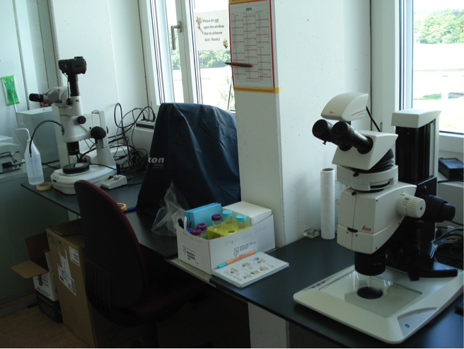

Supplementary information for Altermatt et al. Methods in Ecology and Evolution. DOI: 10.1111/2041-210X.12312

**“Big answers from small worlds: a user's guide for protist microcosms as a model system in ecology and evolution” **

Altermatt F, Fronhofer EA, Garnier A, Giometto A, Hammes F, Klecka J, Legrand D, Mächler E, Massie TM, Pennekamp F, Plebani M, Pontarp M, Schtickzelle N, Thuillier V & Petchey OL

**2.2 Estimating abundances by eye (Microscopy) **

**Introduction**

Protist ecology has successfully used optical microscopes for estimating protist densities and for observing cell features since its very beginning ([Gause 1934](#_ENREF_1); [Vandermeer 1969](#_ENREF_3); [Luckinbill 1973](#_ENREF_2)). Different methods and different microscopes can be used for counting protists depending on their cell size, their population density and whether they are in monoculture or in combination with other protist species. Most protist species, having a body length in the range of 10 to 300 μm and densities of 10 to \>10,000 individuals/ml, can be counted using dissecting microscopes (=stereomicroscope, see Fig. S1); these microscopes are provided with a single objective which allow to zoom up to a magnification of ~160x. Compound microscopes, capable of higher magnification (usually up to 1000x), allow the detection and the counting of very small organisms (e.g., microflagellates and small amoebae) and the observation of cells in detail (e.g., for evidence of parasitism). Inverted microscopes are compound microscopes in which the light source is set above the stage and the objectives are below the stage. Their magnification is more limited than in normal compound microscopes (usually up to 40x objectives); on the other hand they allow the observation of deeper containers (such as Sedgewick Rafter cell counters: see below under “equipment”).

Most modern microscopes have an internal light source for lighting the observed sample, and they allow different kinds of lighting. Dark-field illumination, which emphasizes cells over a dark background, is the classic method used for counting protists with dissecting microscopes; it can be obtained by either using a stage with dark field capability, or more recently a separate LED ring. Dark-field microscopy allows telling species apart even when they are present in the sample at the same time.

In principle, all microscopes can be accessorized with cameras and/or video-cameras (see section 2.3), allowing automated counting or species delimitations. However, even in this case it is commonly advised to regularly check the cultures by eye, as this can give information on the conditions of the cultures otherwise not available.

Fig. S1. Two working spaces equipped with high-end stereomicroscopes and cameras. Microscopes are equipped with dark field illumination. Note: for working on the microscopes, blinds of the windows would be lowered to avoid reflections and uncontrolled illumination. Next to the microscopes, a calendar is given to reserve slots for individual work-projects. Photo by Florian Altermatt.

**Materials**

***Equipment***

-   Dissecting microscope with dark field illumination.

-   Multiple lens (compound) optical microscope.

-   Inverted optical microscope.

-   Vials: many types are available. Commonly used are:

1.  *disposable Petri dishes*, used for counting protists with dissecting microscopes; keep at hand at least three times as many 5 cm diameter plastic Petri dishes as microcosms to count, in a plastic tub or box.

2.  *microscope slides*, which allow the observation of individual cells in detail.

3.  *Sedgewick Rafter cell counters;* they consist of a vial holding 1 ml of volume, 1 mm deep, with a reference grid with units of 1 mm x 1 mm. They are useful for characterizing the micro-plankton from field samples.

4.  *Haemocytometers* and other counting chambers (see photograph *c*); they are provided with a reference grid with units of 1 μm x 1 μm, allowing the count of very small protists and of bacteria.

-   A plastic tub to put used Petri dishes in.

-   Some paper towels.

-   Clicker counter.

-   Container for disposing of pipette tips or Pasteur pipettes.

-   About 1m of bench space.

-   Tissue for cleaning microscope optics.

-   Pen for writing on datasheet.

-   Datasheet for recording information. Such a sheet should report the information as follows:

| Date: …………………. Sampler name: ………………                                                  
                                                                                       
 Experiment: ………………….……………….……………..                                                    
                                                                                       
 | Experimental                                                                        
                                                                                       
  Unit unique ID  | Time | Species | Volume.1 | Volume.2 | Volume.3 | Cell             
                                                                                       
                                                                     count  | Notes |  
 |----------------|------|---------|----------|----------|----------|-------|-------|  
 |                |      |         |          |          |          |       |       |  
 |                |      |         |          |          |          |       |       |  
 |                |      |         |          |          |          |       |       |  |
|--------------------------------------------------------------------------------------|

-   200 μl pipette and 1000 μl pipette (Gilson-type) with their sterile tips or balance accurate to 0.01g, sterile Pasteur pipettes with teats.

***Reagents***

-   Ethanol 70%.

-   Immersion oil.

-   Protist Pellet Medium (PPM) for dilution (the diluent), in a jar (must not contain any protists).

**Procedure**

Counting protists with a dissecting microscope can be done using two different methods: using a Gilson-type pipette, or using a balance.

*Counting protists using a Gilson-type pipette*

1.  Enter onto the datasheet that you are using this method. Do not switch between methods.

2.  Ensure that microcosms are out of the experimental environment for as short a time as possible.

3.  Get a plastic Petri dish ready to receive a sample.

4.  Loosen the lid of the microcosm, so it can be removed with one hand.

5.  Get a pipette with sterile tip ready in one hand.

6.  Swirl the microcosm to well mix the contents.

7.  Remove lid with one hand (do not put down the lid), withdraw a sample with the pipette that you have in your other hand, replace the lid. The volume of this sample is “Volume.1” on the datasheet.

8.  Put the lid back onto the microcosm, and move the microcosms to a safe place. We are finished with it, and don’t want to risk knocking it over, or putting something back into it.

9.  Place the withdrawn medium in small drops on a Petri dish; dispose the drops in lines and rows (see picture *a*).

10. Make sure that the counter is set to zero.

11. Look at the drops under the dissecting microscope (see photograph *b,c*). Adjust illumination and magnification as required. If the drops contain few enough individuals, count now using a clicker counter to make a running total across all the drops (you need to record only the total number of individuals in all drops, not the number in each drop). Move from one drop to the other to avoid missing any.

12. Dilute the sample if the cells are too many to be counted reliably. Use the 1000 μl pipette to put a suitable amount of diluent into the Petri dish and mix well with the sample, by squirting in and out of the pipette. Record the new volume (the sum of the original volume and the volume of diluent added) in column “Volume.2” of the datasheet. Now withdraw a fraction of the diluted volume and repeat steps 9 to 11. The new sampled volume is now “Volume.3” on the datasheet.

13. Write on the datasheet the number of cells observed (in column “Cell count”), the volumes of liquid sampled, and the time (in column “Time”). If there was no dilution, enter dashes in columns “Volume.2” and “Volume.3” (do not leave these blank).

14. Set the counter back to zero.

15. Dispose of the Petri dish or put it in a plastic tub for washing it when the counting session is over.

*Counting protists using a balance*

1.  Enter onto the datasheet that you are using this method. Do not switch between methods.

2.  Ensure that microcosms are out of the experimental environment for as short a time as possible.

3.  Get a plastic Petri dish ready to receive a sample: put it onto the balance, tare the balance, put the dish back on the desk.

4.  Loosen the lid of the microcosm, so it can be removed with one hand.

5.  Get a sterile Pasteur pipette ready in one hand.

6.  Swirl the microcosm to well mix the contents.

7.  Remove lid with one hand (do not put down the lid), withdraw a sample with the pipette that you have in your other hand, replace the lid.

8.  Put the lid back onto the microcosm, and move the microcosms to a safe place. We are finished with it, and do not want to risk knocking it over, or putting something back into it.

9.  Distribute the sample in small drops onto a clean Petri dish.

10. Place the dish on the balance and record the weight in the “Volume.1” column.

11. Look at the drops under the dissecting microscope. Adjust illumination and magnification as required. If the drops contain few enough individuals, count now using a clicker counter to make a running total across all the drops (you need record only the total number of individuals in all drops, not the number in each drop). Move from one drop to the other to avoid missing any.

12. If the drops contain too many individuals to count, you need to dilute. Put a suitable amount of diluent into the Petri dish, and mix well with the sample, by squirting in and out of the pipette. Put the dish onto the balance again, and record the new weight (due to the volume of diluent plus the original amount of volume) in column “Volume.2” on the datasheet.

13. Get a fresh plastic Petri dish ready to receive a sample of the diluted sample: put it onto the balance, **tare the balance**, put the dish back on the desk.

14. Mix the diluent well with the sample, by squirting in and out of the pipette. Now do steps 9, 10, 11 on this diluted liquid, except the volume in step 9 is now “Volume.3” on the datasheet.

15. Withdraw a new sample from this diluted liquid and put it in small drops onto a new Petri dish. The new sampling volume is now “Volume.3” on the datasheet.

16. Make sure on the datasheet you have written: the number of cells observed (in column “Cell count”), the volumes of liquid sampled, and the time (in column “Time”). If there was no dilution, enter dashes in columns “Volume.2” and “Volume.3” (do not leave these blank).

17. Put used Petri dishes into the plastic tub for this.

*Counting protists with a Counting chamber*

1.  Enter onto the datasheet that you are using this method. Do not switch between methods.

2.  Ensure that microcosms are out of the experimental environment for as short a time as possible.

3.  Get a plastic Petri dish ready to receive a sample.

4.  Loosen the lid of the microcosm, so it can be removed with one hand.

5.  Get a pipette with sterile tip ready in one hand.

6.  Swirl the microcosm to well mix the contents.

7.  Remove lid with one hand (do not put down the lid), withdraw a sample with the pipette that you have in your other hand, replace the lid. The volume of this sample is “Volume.1” on the datasheet.

8.  Put the lid back onto the microcosm, and move the microcosms to a safe place. We are finished with it, and don’t want to risk knocking it over, or putting something back into it.

9.  Place the medium in the counting chamber.

10. Place the counting chamber under the microscope.

11. Make sure that the counter is set to zero.

12. Count the cells in the sample using the counter; move along the grid in a regular, standardized way.

13. Record the number of cells in column “Cell count” of the datasheet.

14. Dilute the sample if the cells are too many to be counted reliably. Therefore, add a new sample from the microcosm of volume = Volume.1 into a Petri dish or scintillation vial. Use the 1000 μl pipette to add a suitable amount of diluent (about 5 to 20 times the volume of the sample is usually appropriate) and mix well by squirting in and out of the pipette. Record the new volume (the sum of the volume of the sample and the volume of diluent added) in column “Volume.2” of the datasheet. Now withdraw a subsample of Volume.2 and repeat steps 9 to 13. The newly sub-sampled volume is now “Volume.3” on the datasheet.

15. Write on the datasheet the number of cells observed for each species in the column “Cell count”, the sample volume in column “Volume.1”, and the dilution volumes in case a dilution was necessary.

16. Dispose of the counting chamber (if disposable) or wash it thoroughly before processing a new sample.

*Clean up after the counting session*

1.  Wash the plastic Petri dishes, wiping the surface with a sponge, and giving them a quick rinse, then stacking them to dry.

2.  Wipe down surfaces.

3.  Tidy workspace so that others could use it.

4.  Clean the eyepiece with ethanol 70% after use.

5.  Cover the microscope after use.

6.  Ensure adequate supplies are available for next sampling event.

**Timing **

You will be quite slow at first, but will speed up a lot. For a monoculture, this process should take a couple of minutes for one microcosm. Cleaning up after the sampling session could take about 15 minutes.

**Troubleshooting (Tips and Tricks)**

-   Remember that the total magnification of a microscope is the product of the magnification offered by the objective in use and of the magnification due to the eyepiece (fixed; either 2x, 10x or, less commonly, 50x).

-   Switch the microscope on, *then* dime the illumination up; dime the illumination down *before* switching the microscope off.

-   *What volume to sample?* Often removing 0.5ml is a good option. However, when population sizes are low, this may result in high sampling error (e.g., zero counts when individuals are present). When population sizes are high, considerable diluent will be required (a couple of ml). With experience, you will be able to adjust the volume sampled, and the volume of diluent, to get good counts.

-   *What is a good count?* You should aim at sampling a volume that allows counting a least ten individuals minimum across the whole sample, and not more than about 15 per drop maximum. We control the maximum number of individuals by dilution. We can’t always have so much control over the minimum number of individuals, since this is in large part determined by the population density in the microcosm.

<!-- -->

-   *What if we need to have accurate counts of rare species?* We then have to sample a larger volume. We could withdraw 5 ml, place it into a sterile Petri dish, count individuals in it, and put it back into the media. If we are fine with replacing 5 ml of fresh media at each sample, we do not have to worry about sterility here.

<!-- -->

-   *What if my communities contain multiple species?* Use the same method, but be ready to count some species in the undiluted sample, and others in the diluted sample. Two different dilutions may be required. It may even be useful to couple sampling of small volumes for abundant species, with larger volumes for rare species. All this adds lots of time to the processes. Sampling a community with 10 or more species can take over 15 minutes.

<!-- -->

-   You may find it useful to remove samples from multiple microcosms in the room with the incubator, and then count them elsewhere. This avoids lots of going back and forth, or removing multiple microcosms from incubators for prolonged periods.

-   If no dilution was necessary, the mean cell density per ml equals to:

<!-- -->

-   If a dilution was necessary, the mean cell density per ml is estimated as follows:

*(Cell count / Volume.3) \* (Volume.1 / Volume.2)*

**Anticipated results**

Reliable estimates of cell densities.

**References**

Gause, G.F. (1934) *The Struggle for Existence*. Dover Publications, Mineaola, N.Y.

Luckinbill, L.S. (1973) Coexistence in Laboratory Populations of Paramecium Aurelia and Its Predator Didinium Nasutum. *Ecology,* **54,** 1320-1327.

Vandermeer, J.H. (1969) The Competitive Structure of Communities: An Experimental Approach with Protozoa. *Ecology,* **50,** 362-371.
