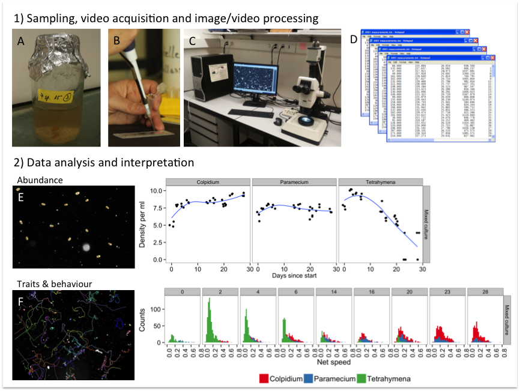

Supplementary information for Altermatt et al. Methods in Ecology and Evolution. DOI: 10.1111/2041-210X.12312

**“Big answers from small worlds: a user's guide for protist microcosms as a model system in ecology and evolution” **

Altermatt F, Fronhofer EA, Garnier A, Giometto A, Hammes F, Klecka J, Legrand D, Mächler E, Massie TM, Pennekamp F, Plebani M, Pontarp M, Schtickzelle N, Thuillier V & Petchey OL

**2.3 Image and video analysis**

**Introduction**

Digital image and video analysis has successfully been used to reduce the amount of time spent by researchers at the microscope performing manual counts and enables to quantify a variety of traits simultaneously ([Pennekamp & Schtickzelle 2013](#_ENREF_18); [Dell *et al.* 2014](#_ENREF_6)). The fast collection and processing of a large amount of data especially enables the use of microcosm experiments in a trait-based community ecology approach ([McGill *et al.* 2006](#_ENREF_15)). Fig. S1 gives a general overview of the process of sampling, processing and analysing protist experiments using image and video analyses.

Examples of successful application of image and video analysis in protist microcosm experiments include measures of population dynamics in constant and fluctuating environments ([Laakso, Loytynoja & Kaitala 2003](#_ENREF_12); [Fjerdingstad *et al.* 2007](#_ENREF_7)), dispersal ([Pennekamp *et al.* 2014](#_ENREF_17)), movement ([Fronhofer & Altermatt 2014](#_ENREF_8); [Fronhofer, Kropf & Altermatt 2014](#_ENREF_9); [Giometto *et al.* 2014](#_ENREF_10)), morphology ([Fjerdingstad *et al.* 2007](#_ENREF_7); [Pennekamp *et al.* 2014](#_ENREF_17)), and behaviour ([Schtickzelle *et al.* 2009](#_ENREF_20); [Chaine *et al.* 2010](#_ENREF_3)), spanning levels of organization from the individual to the community level.

Digital image analysis is especially suited when more than abundance data is to be collected ([Dell *et al.* 2014](#_ENREF_6)), for instance morphological or behavioural data on a large number of individuals across many treatments and replicates. It is also highly convenient to scan large numbers of protist genotypes for ecologically important life history variation including traits like dispersal ([Fjerdingstad *et al.* 2007](#_ENREF_7); [Pennekamp *et al.* 2014](#_ENREF_17)), which is of high relevance for the field of phenomics and was used for instance with nematodes ([Yemini *et al.* 2013](#_ENREF_23)).

Because the experimenter will only take image and video samples from the experimental cultures, the subjective component of manual counts, which depends on the experience and skills of the experimenter, is reduced. Thus, a number of people with different degrees of experience can collect data for a single experiment without observer bias, and images/videos from different experiments can be easily compared as long as the experimental settings remained fixed.

However, these advantages come at the cost of setting up and fine-tuning such an automated system, which requires some financial investment in the appropriate hardware and time of a skilled technician or lab member to mould hardware and software into a validated workflow. Accordingly, one-shot experiments to answer a specific question, may be still be solved faster by manual observations and measurements. In addition, the resolution of cameras collecting abundance and morphological/behavioural data simultaneously is generally too low for measurements at the sub-individual level, such as specific organelles or features such as the buccal cavity of certain protist species. However, taking images/videos at different magnifications would circumvent this problem without major modifications.

Fig. S1. Overview of the different steps in an automated image/video analysis work flow: 1) microcosms are sampled (A) and a fixed volume transferred to a counting chamber (B). The chamber is placed on the microscope stage and videos are taken via a camera coupled to the microscope, which can be controlled remotely from a computer (C). Image/video analysis software such as ImageJ is then used to process, segment and extract the information on images/videos and transformed into quantitative data in a machine-readable format (D). 2) The data stored in a database is then ready for further processing, analysis and interpretation. Two examples are shown illustrating the identification of target individuals: the abundance of protists can be estimated from a photo and up scaled to the density in the microcosm (E). (By sampling on multiple occasions through time, the population dynamics of different species are captured.) The second example is the re-construction of movement trajectories from videos (F). Using video, behavioural traits such as movement speed are captured and trait distributions in communities can be analysed.

Alternative methodologies that provide abundance and trait data simultaneously include flow cytometry (see section 2.5), particle counters (see section 2.4) and integrated systems combining flow cytometry with automated image analysis such as FlowCAM® (Fluid Imaging Technologies) ([Sieracki, Sieracki & Yentsch 1998](#_ENREF_21)). The former can quantify morphological traits such as cell size and cell shape and be combined with fluorescence staining to yield information on DNA contents ([Van Nevel *et al.* 2013](#_ENREF_22)), but cannot identify more complex shapes and no behavioural interactions can be measured due to its invasive nature and its measurement technique (see section 2.8 for details).

Whereas the above applications are well developed for characterizing traits and abundance of single species systems, complex communities with many species with overlapping morphologies are still a considerable challenge, but recent work on digital video analysis shows that it is feasible given sufficient differentiation in morphology and/or behaviour (especially movement behaviour, which is often a distinct feature of protist species). Work with microcosms is insofar easier that usually a limited and known number of species inhabits a community and reference data for the different morphologies and behaviours is readily available from monocultures. After individuals of each species can be reliably distinguished from videos of a complex community, the next step is the automated quantification of interspecific interactions such as predation or interference competition ([Delgado *et al.* 2014](#_ENREF_5)). These applications however require powerful tracking algorithms that can deal with so-called occlusions, the overlapping of two cells without loosing track of the individual identities (morphological properties and species identity) ([Dell *et al.* 2014](#_ENREF_6)). Such tracking algorithms become increasingly available (e.g., Ctrax ([Branson *et al.* 2009](#_ENREF_2)) or idTracker ([Pérez-Escudero *et al.* 2014](#_ENREF_19))) but no demonstrations are so far available for protists. Another issue with video tracking is that except for some sophisticated 3D systems, most tracking is still performed in two dimensions. This is a simplification, which is likely to disappear in the coming years as both hardware and software are becoming available to do such tasks efficiently ([Dell *et al.* 2014](#_ENREF_6)).

For an optimal use, the illumination during image/video acquisition should be fixed and optimized to yield the best contrast between the protists and the experimental arena. Measurements are taken in counting chambers or directly *in situ* in culture vessels. The resulting images/videos are then processed to separate protists (foreground) from the experimental arena (background) in a step called segmentation. Different algorithms are available whose performance depends on the properties of the protists (e.g., movement) and the nature of the surrounding medium (e.g., debris particles in the medium). After segmentation, the number and morphological properties and spatial position of all identified individuals are extracted from each image. For videos, this information is available for each frame allowing to consequently track the movement of the individuals through time using dedicated tracking software ([Dell *et al.* 2014](#_ENREF_6)). So far, automated image/video analysis systems are mainly used in single species microcosms. Efforts to develop systems for automated sampling in marine environments and activated sludge of water treatment facilities have shown some success ([e.g., Amaral *et al.* 2004](#_ENREF_1)) and should be facilitated by the low species numbers in microcosms and the availability of high quality data to calibrate the classification algorithms used (e.g. artificial neural networks or random forest classification).

A variety of measurements can be taken from images and videos (see Fig. S1 for a general overview of the process of sampling, processing and analysis). Several recent publications describe in detail how to setup an image/video acquisition and processing pipeline in ecology and evolution (e.g., [Kühl & Burghardt 2013](#_ENREF_11); [Mallard, Le Bourlot & Tully 2013](#_ENREF_14); [Mesquita, Amaral & Ferreira 2013](#_ENREF_16); [Pennekamp & Schtickzelle 2013](#_ENREF_18); [Dell *et al.* 2014](#_ENREF_6)), providing scripts for the automated image analysis ([Pennekamp & Schtickzelle 2013](#_ENREF_18)) or plug-ins for software like ImageJ ([Mallard, Le Bourlot & Tully 2013](#_ENREF_14)). Therefore, we here focus on giving an overview of the equipment required and point to specific difficulties and limitations of image/video analysis in microcosm systems. Furthermore, integrated systems using a combination of flow cytometry and image analysis such as FlowCAM® (Fluid Imaging Technologies) ([Sieracki, Sieracki & Yentsch 1998](#_ENREF_21)) rely on the same principles as the respective techniques and will therefore not be covered explicitly here.

**Material **

***Equipment***

*Microscope or stereomicroscope with a C-mount video adapter to connect a camera *

The magnification and illumination (brightfield versus darkfield) of the experimental chamber depend on the optical equipment used and is discussed in section 2.2. Protists are generally transparent, therefore darkfield microscopy improves the contrast between them and the background of the chamber. However, protist can appear coloured due to the ingestion of pigmented food particles such as algae. Image analysis usually disregards colour, if it does not provide additional information value and images and videos in grey scale are analysed for computational efficiency. The use of fluorescence techniques usually requires specialized hardware as well.

Individualized adapters for mounting cameras to microscopes are for example provided by Micro Tech Lab company, Graz, Austria ([www.LMscope.com](http://www.LMscope.com)).

*Digital (video) camera *

The abilities of the acquisition hardware depend on the research question and range from high-resolution and frame rate cameras for detailed individual level descriptions of movement behaviour and morphology (e.g., Hamamatsu Orca Flash 4.0 sCMOS Camera), to powerful customer cameras (e.g., Canon Mark III 5D) that can be coupled to microscopes via adaptors which capture relevant variation on the individual level, but do not allow for sub-individual measurements. For some setups, high-end web cams may be sufficient and provide a better price-to-usability ratio. If colour is used for protist detection/species classification, cameras need to have colour capability. Larger sensors usually allow capturing a larger area of the viewing field increasing the total volume sampled.

*Light*

Inhomogeneous illumination, shadows due to unilateral light sources and changes in light during a sequence are to be avoided, although techniques exist that can deal to a certain degree with such problems and certain segmentation approaches (difference imaging) can deal with changing light conditions. However, it is always better to avoid these nuisances in the first place by sufficiently testing the setup.

*Chamber*

Images/videos are acquired from samples either pipetted in re-usable counting chambers (e.g., Sedgewick-Rafter) or disposable chambers used for instance in urinary analyses, which cannot be cleaned but allow for faster image acquisition. These counting chambers usually guarantee a sufficient depth-of-field such that all individuals are in the focal plane. They do however restrict the volume sampled, which may be problematic if species are at low abundance. Sampling several samples or taking repeated samples from different areas of the counting slide would mitigate this limitation. Condensation on the walls of the disposable chambers might impede the recording of videos. To avoid such inconvenience, the use of cell culture flasks with ventilated top is recommended.

Sampling *in situ* using transparent culture vessels such as Petri dishes or cell culture flasks may be used for non-invasive sampling of the cultures, if the depth-of-field can be extended for example due to the use of diaphragms build into the microscope or customized solutions.

*Software*

Many software solutions for image and video analysis exist, however, ImageJ (Image Processing and Analysis in Java; developed at the National Institutes of Health) is among the most popular. ImageJ is a widely used open source solution, which is fast, user-friendly and well-supported by a user community. Many cutting edge segmentation methods are quickly adopted and plug-ins for specific tasks such as tracking are readily available. For video tracking, Dell et al. ([2014](#_ENREF_6)) provide an overview of software ranging from commercial to open source solutions. In addition, software to automate the merging of results and following analysis is generally advised.

*Computer hardware and disk space for storage*

The analysis of digital images and videos can be a computationally demanding task, depending on the resolution and number of images to process, and the complexity of the image analysis task. Especially the sophisticated tracking algorithms can require considerable time to connect a large number of individuals through lengthy video sequences. Therefore, powerful computer hardware, especially the availability of large amounts of RAM (\> 8 GB) and fast CPU are a requirement. In addition, large amounts of disk space are required to store videos, which often need to be in an uncompressed format to be processed by image analysis software (e.g., ImageJ) and therefore can quickly accumulate to terabytes of storage space; for long-term storage, we recommend to compress files with lossless formats to reduce space requirements but still allow re-analysis at the original quality if needed.

***Reagents***

Usually video analysis does not require any reagents, however adding methylcellulose may help to slow down dynamics such they can be capture by video equipment which lacks very high frame rates (see also section 3.4).

Individual marking of protists is difficult, and sophisticated image analysis approaches to distinguish individuals by subtle differences in their appearance ([“fingerprinting”, Pérez-Escudero *et al.* 2014](#_ENREF_19)), are also difficult due to low morphological differentiation and limitation to low numbers of individuals in controlled settings. However, fluorescence marking and quantum dots ([Daims & Wagner 2007](#_ENREF_4); [Lard *et al.* 2010](#_ENREF_13)) are two ways of visually separating two morphologically and behaviourally identical populations or to improve the tracking abilities under difficult settings.

**Procedure**

The major procedure of this protocol is setting up the image/video acquisition system (including the illumination and sampling chamber) and the automation of the image/video processing rather than the videoing itself to which the same requirements apply as to the sampling and general microscopy (see section 2.2). Other information about procedures is available in the following references.

**References**

Amaral, A.L., Motta, M.d., Pons, M.N., Vivier, H., Roche, N., Mota, M. & Ferreira, E.C. (2004) Survey of Protozoa and Metazoa populations in wastewater treatment plants by image analysis and discriminant analysis *Environmetrics,* **15,** 381-390.

Branson, K., Robie, A.A., Bender, J., Perona, P. & Dickinson, M.H. (2009) High-throughput ethomics in large groups of Drosophila. *Nature Methods,* **6,** 451-457.

Chaine, A.S., Schtickzelle, N., Polard, T., Huet, M. & Clobert, J. (2010) Kin-based recognition and social aggregation in a ciliate. *Evolution,* **64,** 1290-1300.

Daims, H. & Wagner, M. (2007) Quantification of uncultured microorganisms by fluorescence microscopy and digital image analysis. *Applied Microbiology and Biotechnology,* **75,** 237-248.

Delgado, M.d.M., Penteriani, V., Morales, J.M., Gurarie, E. & Ovaskainen, O. (2014) A statistical framework for inferring the influence of conspecifics on movement behaviour. *Methods in Ecology and Evolution,* **5,** 183-189.

Dell, A.I., Bender, J.A., Branson, K., Couzin, I.D., de Polavieja, G.G., Noldus, L.P.J.J., Pérez-Escudero, A., Perona, P., Straw, A.D., Wikelski, M. & Brose, U. (2014) Automated image-based tracking and its application in ecology. *Trends in Ecology & Evolution,* **29,** 417-428.

Fjerdingstad, E., Schtickzelle, N., Manhes, P., Gutierrez, A. & Clobert, J. (2007) Evolution of dispersal and life history strategies - *Tetrahymena* ciliates. *BMC Evolutionary Biology,* **7,** 133.

Fronhofer, E.A. & Altermatt, F. (2014) Eco-evolutionary dynamics at the edge: experimental invasions reveal fundamental shifts in life-history strategies.

Fronhofer, E.A., Kropf, T. & Altermatt, F. (2014) Density-dependent movement and the consequences of the Allee effect in the model organism Tetrahymena. *Journal of Animal Ecology*.

Giometto, A., Rinaldo, A., Carrara, F. & Altermatt, F. (2014) Emerging predictable features of replicated biological invasion fronts. *Proceedings of the National Academy of Sciences,* **111,** 297-301.

Kühl, H.S. & Burghardt, T. (2013) Animal biometrics: quantifying and detecting phenotypic appearance. *Trends in Ecology & Evolution,* **28,** 432-441.

Laakso, J., Loytynoja, K. & Kaitala, V. (2003) Environmental noise and population dynamics of the ciliated protozoa *Tetrahymena thermophila* in aquatic microcosms. *Oikos,* **102,** 663-671.

Lard, M., Bäckman, J., Yakovleva, M., Danielsson, B. & Hansson, L.-A. (2010) Tracking the Small with the Smallest – Using Nanotechnology in Tracking Zooplankton. *PLoS ONE,* **5**.

Mallard, F., Le Bourlot, V. & Tully, T. (2013) An automated image analysis system to measure and count organisms in laboratory microcosms. *PLoS ONE,* **8**.

McGill, B.J., Enquist, B.J., Weiher, E. & Westoby, M. (2006) Rebuilding community ecology from functional traits. *Trends in Ecology & Evolution,* **21,** 178-185.

Mesquita, D.P., Amaral, A.L. & Ferreira, E.C. (2013) Activated sludge characterization through microscopy: A review on quantitative image analysis and chemometric techniques. *Analytica Chimica Acta,* **802,** 14-28.

Pennekamp, F., Mitchell, K.A., Chaine, A. & Schtickzelle, N. (2014) Dispersal propensity in *Tetrahymena* *thermophila* ciliates—a reaction norm perspective. *Evolution,* **68,** 2319-2330.

Pennekamp, F. & Schtickzelle, N. (2013) Implementing image analysis in laboratory-based experimental systems for ecology and evolution: a hands-on guide. *Methods in Ecology and Evolution,* **4,** 483-492.

Pérez-Escudero, A., Vicente-Page, J., Hinz, R.C., Arganda, S. & de Polavieja, G.G. (2014) idTracker: tracking individuals in a group by automatic identification of unmarked animals. *Nature Methods,* **advance online publication**.

Schtickzelle, N., Fjerdingstad, E., Chaine, A. & Clobert, J. (2009) Cooperative social clusters are not destroyed by dispersal in a ciliate. *BMC Evolutionary Biology,* **9**.

Sieracki, C.K., Sieracki, M.E. & Yentsch, C.S. (1998) An imaging-in-flow system for automated analysis of marine microplankton. *Marine Ecology Progress Series,* **168,** 285-296.

Van Nevel, S., Koetzsch, S., Weilenmann, H.-U., Boon, N. & Hammes, F. (2013) Routine bacterial analysis with automated flow cytometry. *Journal of Microbiological Methods,* **94,** 73-76.

Yemini, E., Jucikas, T., Grundy, L.J., Brown, A.E.X. & Schafer, W.R. (2013) A database of Caenorhabditis elegans behavioral phenotypes. *Nature Methods,* **10,** 877-879.
