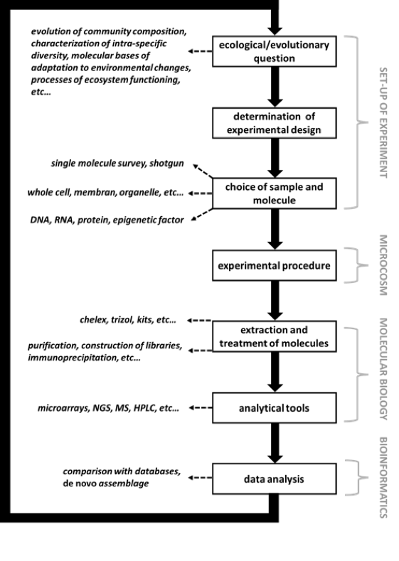

Supplementary information for Altermatt et al. Methods in Ecology and Evolution. DOI: 10.1111/2041-210X.12312

**“Big answers from small worlds: a user's guide for protist microcosms as a model system in ecology and evolution” **

Altermatt F, Fronhofer EA, Garnier A, Giometto A, Hammes F, Klecka J, Legrand D, Mächler E, Massie TM, Pennekamp F, Plebani M, Pontarp M, Schtickzelle N, Thuillier V & Petchey OL

**2.8 Genomics, proteomics, and epigenomics**

**Introduction**

The aim of ‘omics’ approaches (genomics, transcriptomics, proteomics, epigenomics) is to characterize whole molecular content in a sample (DNA, RNA, proteins, epigenetic factors). A sample may refer to a part of an individual (organ, tissue, organelle, etc.), an entire individual, a population, a community or an environmental sample. ‘Omics’ approaches are largely used by ecologists and evolutionary biologists because they may inform on the diversity of environmental samples, on the molecular bases of organism adaptations, on the modality of genome evolution, on organism-environment interactions, and on the processes of ecosystem functioning ([Vandenkoornhuyse *et al.* 2010](#_ENREF_46); [Gilbert & Dupont 2011](#_ENREF_14)).

Although the general framework is the same for all taxa and all ‘omics’ (see below), the variety of molecules and applications of these approaches implies that it exists a huge number of available methods and protocols, even in the restricted protist group. Thus, it is an important decision to choose the most appropriate methods from all available ones, in order to answer the question of interest.

Rather than providing an exhaustive and surely incomplete list of detailed protocols, in this supplement, we have chosen first to briefly present the general framework of ‘omics’ methods. Then, we present relevant examples of specific methodologies within each ‘omics’ that we think of particular interest to study protist microcosms. For these selected examples, we detail the main steps required to obtain the data and refer to published manuscripts in which readers will be able to find the detailed protocols. Finally, we also provide at the end of each example a list of general and sometimes protist-specific review papers.

**‘Omics’ general framework applied to experimental protist microcosms**

High-throughput methods have rapidly spread in the field of ecology and evolution because they allow capturing massive molecular data on a specific sample. The general workflow of these methods is presented in Figure S1. Depending on the question raised, two strategies can be adopted to collect information. The first consists in performing random shotguns to capture all environmental molecules in a sample. In microcosms, this strategy can be used to assess the physiological responses of communities to changing or stressful environmental conditions, to determine the changes in magnitude or rates of material and energetic fluxes within and between recreated ecosystems ([Gotelli, Ellison & Ballif 2012](#_ENREF_16)), or else to reconstruct the global molecular content of target individuals (whole-genome, -transcriptome, -proteome or -epigenome). The second strategy consists in performing single molecule surveys within a sample. This can be particularly useful to follow the species composition within a community, to determine the role of target molecules in organisms’ adaptation to perturbations (e.g., specific alleles, interfering RNA, heat shock proteins), or to identify common molecules between communities ([Gilbert & Dupont 2011](#_ENREF_14)).

After the pre-experimental step and the resulting microcosm manipulation, samples to analyse are taken to the molecular biology laboratory in order to perform the extraction step. Depending on the question, either media or cells will be kept to perform extractions. This can be achieved by centrifugation or by using filters. To separate cells of different sizes, it can be useful to perform successive filtering using different meshes. More sophisticated methods can also be used to precisely determine the number of cells that will be extracted (see sections 2.2-2.4). Also, some applications may require the isolation of unique cells, which can be achieve by micromanipulations or fluorescence-activated cell sorting (FACS). An additional step can consist in the isolation of a particular cell component like the cell membrane, micro or macro-nucleus in ciliates, phagosomes or pellicles.

There exist numerous techniques and protocols to perform extractions. The extraction-step will depend upon the biological sample, the target molecules and the analytical tools used to obtain the data. Although manufactured kits may be more expensive than traditional methods (e.g., chelex, trizol, phenol/chloroform), they may be advantageous because some are adapted to cell cultures, the quality of extracts is often high, and some kits couple the isolation of molecules to the post-extraction treatments needed to the analytical step.

The choice of post-extraction treatments will then depend upon the molecule type and the desired coverage of the data. For example, deep and high-resolution proteomes will be obtained by the cross-use of 2-dimensional gel electrophoresis and high performance liquid chromatography/mass spectrometry ([Wright *et al.* 2012](#_ENREF_47)), which means that the protein extract loaded on a gel will be treated with trypsin after excision. Another example of a post-extraction treatment is the purification of mRNA from total RNA extraction with oligo(dT) magnetic bead, that will be further fragmented, amplified and ligated with adaptators specific to the Next Generation Sequencer used to obtain transcriptomes.

Once massive data are generated, they are analysed using bioinformatics tools. In non-model organisms, the challenge is the *de novo* assemblage and characterization of the data, while model organisms have published biological molecules accessible on web databases (e.g., NCBI and Swiss Prot). Some databases are taxon-specific, species-specific and/or marker-specific (e.g., EnsemblProtists, Tetrahymena Genome Database TGD, Protist Ribosomal Reference Database, Paramecium Database PDB). The bioinformatic treatment of massive data is not trivial for most evolutionary ecologists, but Next Generation Sequencing (NGS) platforms and analytic tool developers generally provide help or services to achieve the task.

‘Omics’ have been proven very informative and powerful in a large number of recent studies, but one can keep in mind that some strong limitations exist to these methods. Troubleshooting may appear at each step of the workflow: sample contaminations, non-reproducible results between techniques, biases during amplification and/or detection of the data, divergent results in function of analytical and bioinformatic tools. To overcome these limitations, users often multiply the number of techniques and analyses and keep only concordant conclusions.

There is a series of general reviews on ‘omics’ (e.g., [Ge, Walhout & Vidal 2003](#_ENREF_12); [Quackenbush 2004](#_ENREF_35); [Joyce & Palsson 2006](#_ENREF_23); [Jex *et al.* 2013](#_ENREF_22))

Figure S1: General framework of ‘omics’ methods applied to protist microcosms. The testing of ecological or evolutionary questions involves numerous steps requiring experimental work, molecular biology competences and most often bioinformatic treatments.**
**

**Example of relevant ‘omics’ methods to study protist microcosms**

The study of global contents of environmental samples allows the characterization of free-living protists, like other unicellular organisms. Surprisingly, however, this has not yet let to many eco-evolutionary ‘omics’ studies specifically designed for protist micrososms and taxa therein, but we see a high potential for different uses. A notable exception concerns the study of the genome structure and regulation in ciliates (mostly *Tetrahymena thermophila*, *Paramecium* species and *Oxytricha trifallax*). The following examples therefore refer to potential applications of ‘omics’ methods in protist microcosm studies, for which detailed protocols can be adapted from papers studying other microbial groups, or from papers studying the genome development and cellular physiology in ciliates.

-   **Metagenomics**

A metagenomic study refers to the analysis of the genomic DNA from a whole environmental sample. This method can easily be extended to the context of protist microcosms in which experimenters aim at following the species composition of complex communities over situations and time, both qualitatively and quantitatively. In this case, a good strategy is to choose a sufficiently discriminant marker that will allow the clear distinction of each species (see section 2.7, which details the markers of interest in protist barcoding studies).

Major steps are:

-   Choose and characterize the DNA marker to be sequenced for each species of the tested community.

-   Normalize samples to be extracted.

-   Perform total DNA extraction.

-   Construct DNA libraries adapted to the sequencer type (Sanger, Next Generation sequencer).

-   Sequence libraries.

-   Determine the prevalence of each species in the original sample.

There exist both publications on detailed protocols for metagenomic work (e.g., [Debroas *et al.* 2009](#_ENREF_8); [Ghai *et al.* 2012](#_ENREF_13); [Steffen *et al.* 2012](#_ENREF_38)) as well as a series of review papers (e.g., [Mardis 2008](#_ENREF_29); [Dawson & Fritz-Laylin 2009](#_ENREF_7); [Gilbert & Dupont 2011](#_ENREF_14); [Temperton & Giovannoni 2012](#_ENREF_42)).

-   **Single cell genomics**

The recently developed single cell genomic approach consists in the sequencing of the whole DNA content in a single cell. Therefore, it allows capturing the entire genome of an individual (nuclear and mitochondrial genomes) but also the genomic content of its endo-parasites or ingested preys. This technique appears promising in the context of protist microcosms because experimenters can directly analyse genome-genome associations of host-parasites or prey-predators interactions.

Major steps are:

-   Isolate the target cell to analyse.

-   Perform total DNA extraction.

-   Construct whole-genome DNA libraries adapted to the chosen NGS sequencer.

-   Sequence libraries.

-   Assemble whole-genomes of the isolated cells and the ones of its preys and/or parasites.

There exist detailed published protocols for single-cell genomics (e.g., [Raghunathan *et al.* 2005](#_ENREF_36); [Hongoh *et al.* 2008](#_ENREF_20); [Swan *et al.* 2011](#_ENREF_41); [Yoon *et al.* 2011](#_ENREF_51); [Mason *et al.* 2012](#_ENREF_30)) as well as review papers (e.g., [Kalisky, Blainey & Quake 2011](#_ENREF_24); [Kalisky & Quake 2011](#_ENREF_25); [Lasken 2012](#_ENREF_27); [Stepanauskas 2012](#_ENREF_39); [Blainey & Quake 2014](#_ENREF_3))

-   **Transcriptomics**

The aim of transcription profiling is to develop a complete overview of all the genes in a genome that are up-regulated or down-regulated in response to some factor of interest, in comparison with a designated reference expression ([van Straalen & Roelofs 2011](#_ENREF_44)). Transcriptomic studies have rapidly spread in ecology and evolution because they allow tackling the first level of the functional response of organisms to environmental changes. The most frequent application, including under the fully controlled conditions imposed within microcosms, is to search for differences in the whole-transcript content of phenotypes that diverge in response to particular environmental conditions.

Major steps are:

-   Isolate the divergent phenotypes.

-   Perform total RNA extraction of each phenotype.

-   Construct cDNA libraries adapted to the chosen NGS sequencer.

-   Sequence libraries.

-   Assemble transcriptomes and determine both qualitative and quantitative differences in gene expression between the two phenotypes.

There exist detailed published protocols (e.g., [Pavey *et al.* 2011](#_ENREF_34); [Grant *et al.* 2013](#_ENREF_18)) as well as review papers (e.g., [Hodgins-Davis & Townsend 2009](#_ENREF_19); [Murray, Patterson & Thessen 2012](#_ENREF_31); [van Straalen & Roelofs 2012](#_ENREF_45)).

-   **Proteomics**

To assess the molecular bases of adaptation, evolutionary ecologists commonly use genomic and transcriptomic approaches. The proteomic approach is probably underused because it is more fastidious, requires very good technical skills, and needs expensive measuring equipment. However, proteomes represent the end-result of the adaptive physiological response of organisms to perturbations. Therefore, questions tackled in the transcriptomic paragraph are particularly interesting in a proteomic approach. Another interesting experiment would consist in culturing strains under stressful conditions and determine the variations in the content of protein classes known to play roles in organisms’ stress response, such as heat shock proteins.

Major steps are:

-   Isolate stressed individuals.

-   Extract total protein content.

-   Isolate classes of proteins using 2-dimensional gel electrophoresis.

-   Complete protein characterization using Mass Spectrometry.

-   Analyse the target classes of proteins and determine their qualitative and quantitative content differences under stressful conditions versus control conditions.

There exist both publications on detailed protocols (e.g., [Jacobs *et al.* 2006](#_ENREF_21); [Smith *et al.* 2007](#_ENREF_37); [Gould *et al.* 2010](#_ENREF_17); [Xanthopoulou *et al.* 2010](#_ENREF_48); [Le Bihan *et al.* 2011](#_ENREF_28); [Oehring *et al.* 2012](#_ENREF_33); [Yano *et al.* 2012](#_ENREF_49); [Chen *et al.* 2014](#_ENREF_5)) as well as review articles (e.g., [Tyers & Mann 2003](#_ENREF_43); [Yates *et al.* 2005](#_ENREF_50); [Beck, Claassen & Aebersold 2011](#_ENREF_2); [Dowd 2012](#_ENREF_9); [Gotelli, Ellison & Ballif 2012](#_ENREF_16); [Armengaud *et al.* 2014](#_ENREF_1); [Editorial 2014](#_ENREF_10)).

-   **Changes in DNA methylations**

Epigenetics refers to stimuli-triggered changes in gene expression due to processes that arise independently of changes in the underlying DNA sequence ([Gomez-Diaz *et al.* 2012](#_ENREF_15)). Rapid responses to intense environmental changes are supposed to occur most often through epigenetic mechanisms ([Flores, Wolschin & Amdam 2013](#_ENREF_11)). Among described non-genetic factors there are DNA methylation, histone modification and small non-coding RNAs. Efficient new techniques have been recently developed to determine whole-epigenomes from samples. In experiments aiming at determining the adaptive responses to stressful conditions, the DNA methylation profiles of individuals showing phenotypic adaptations can be compared with profiles of controlled individuals.

Major steps are:

-   Choose the appropriate method or the combination of methods to use.

-   Isolate DNA from target samples.

-   Reveal methylated sites with for example immunoprecipitation or bisulfite sequencing.

-   Determine the methylation profiles of selected phenotypes.

There exist both publications on detailed protocols (e.g., [Karrer & VanNuland 2002](#_ENREF_26); [Bracht, Perlman & Landweber 2012](#_ENREF_4)) as well as review articles (e.g., [Suzuki & Bird 2008](#_ENREF_40); [Nowacki & Landweber 2009](#_ENREF_32); [Croken, Nardelli & Kim 2012](#_ENREF_6); [Gomez-Diaz *et al.* 2012](#_ENREF_15); [Flores, Wolschin & Amdam 2013](#_ENREF_11)).

**References**

Armengaud, J., Trapp, J., Pible, O., Geffard, O., Chaumot, A. & Hartmann, E.M. (2014) Non-model organisms, a species endangered by proteogenomics. *J Proteomics,* **105,** 5-18.

Beck, M., Claassen, M. & Aebersold, R. (2011) Comprehensive proteomics. *Curr Opin Biotechnol,* **22,** 3-8.

Blainey, P.C. & Quake, S.R. (2014) Dissecting genomic diversity, one cell at a time. *Nat Methods,* **11,** 19-21.

Bracht, J.R., Perlman, D.H. & Landweber, L.F. (2012) Cytosine methylation and hydroxymethylation mark DNA for elimination in Oxytricha trifallax. *Genome Biol,* **13,** R99.

Chen, J., Gao, X., Wang, B., Chen, F., Wu, N. & Zhang, Y. (2014) Proteomic approach to reveal the proteins associated with encystment of the ciliate Euplotes encysticus. *PLoS ONE,* **9,** e97362.

Croken, M.M., Nardelli, S.C. & Kim, K. (2012) Chromatin modifications, epigenetics, and how protozoan parasites regulate their lives. *Trends Parasitol,* **28,** 202-213.

Dawson, S.C. & Fritz-Laylin, L.K. (2009) Sequencing free-living protists: the case for metagenomics. *Environ Microbiol,* **11,** 1627-1631.

Debroas, D., Humbert, J.F., Enault, F., Bronner, G., Faubladier, M. & Cornillot, E. (2009) Metagenomic approach studying the taxonomic and functional diversity of the bacterial community in a mesotrophic lake (Lac du Bourget--France). *Environ Microbiol,* **11,** 2412-2424.

Dowd, W.W. (2012) Challenges for biological interpretation of environmental proteomics data in non-model organisms. *Integr Comp Biol,* **52,** 705-720.

Editorial (2014) Challenges and prospects of proteomics of non-model organisms. *Journal of Proteomics,* **105,** 1-4.

Flores, K.B., Wolschin, F. & Amdam, G.V. (2013) The role of methylation of DNA in environmental adaptation. *Integr Comp Biol,* **53,** 359-372.

Ge, H., Walhout, A.J. & Vidal, M. (2003) Integrating 'omic' information: a bridge between genomics and systems biology. *Trends Genet,* **19,** 551-560.

Ghai, R., Hernandez, C.M., Picazo, A., Mizuno, C.M., Ininbergs, K., Diez, B., Valas, R., DuPont, C.L., McMahon, K.D., Camacho, A. & Rodriguez-Valera, F. (2012) Metagenomes of Mediterranean coastal lagoons. *Sci Rep,* **2,** 490.

Gilbert, J.A. & Dupont, C.L. (2011) Microbial metagenomics: beyond the genome. *Ann Rev Mar Sci,* **3,** 347-371.

Gomez-Diaz, E., Jorda, M., Peinado, M.A. & Rivero, A. (2012) Epigenetics of host-pathogen interactions: the road ahead and the road behind. *PLoS Pathog,* **8,** e1003007.

Gotelli, N.J., Ellison, A.M. & Ballif, B.A. (2012) Environmental proteomics, biodiversity statistics and food-web structure. *Trends Ecol Evol,* **27,** 436-442.

Gould, S.B., Kraft, L.G., van Dooren, G.G., Goodman, C.D., Ford, K.L., Cassin, A.M., Bacic, A., McFadden, G.I. & Waller, R.F. (2010) Ciliate pellicular proteome identifies novel protein families with characteristic repeat motifs that are common to alveolates. *Mol Biol Evol,* **28,** 1319-1331.

Grant, J.R., Lahr, D.J.G., Rey, F.E., Burleigh, J.G., Gordon, J.I., Knight, R., Molestina, R.E. & Katz, L.A. (2013) Gene discovery from a pilot study of the transcriptomes from three diverse microbial eukaryotes: Corallomyxa tenera, Chilodonella uncinata, and Subulatomonas tetraspora. *Protis Genomics,* **2,** 3-18.

Hodgins-Davis, A. & Townsend, J.P. (2009) Evolving gene expression: from G to E to G X E. *Trends in Ecology & Evolution,* **24,** 649-658.

Hongoh, Y., Sharma, V.K., Prakash, T., Noda, S., Taylor, T.D., Kudo, T., Sakaki, Y., Toyoda, A., Hattori, M. & Ohkuma, M. (2008) Complete genome of the uncultured Termite Group 1 bacteria in a single host protist cell. *Proc Natl Acad Sci U S A,* **105,** 5555-5560.

Jacobs, M.E., DeSouza, L.V., Samaranayake, H., Pearlman, R.E., Siu, K.W. & Klobutcher, L.A. (2006) The Tetrahymena thermophila phagosome proteome. *Eukaryot Cell,* **5,** 1990-2000.

Jex, A.R., Koehler, A.V., Ansell, B.R., Baker, L., Karunajeewa, H. & Gasser, R.B. (2013) Getting to the guts of the matter: the status and potential of 'omics' research of parasitic protists of the human gastrointestinal system. *Int J Parasitol,* **43,** 971-982.

Joyce, A.R. & Palsson, B.O. (2006) The model organism as a system: integrating 'omics' data sets. *Nat Rev Mol Cell Biol,* **7,** 198-210.

Kalisky, T., Blainey, P. & Quake, S.R. (2011) Genomic analysis at the single-cell level. *Annu Rev Genet,* **45,** 431-445.

Kalisky, T. & Quake, S.R. (2011) Single-cell genomics. *Nat Methods,* **8,** 311-314.

Karrer, K.M. & VanNuland, T.A. (2002) Methylation of adenine in the nuclear DNA of Tetrahymena is internucleosomal and independent of histone H1. *Nucleic Acids Res,* **30,** 1364-1370.

Lasken, R.S. (2012) Genomic sequencing of uncultured microorganisms from single cells. *Nat Rev Microbiol,* **10,** 631-640.

Le Bihan, T., Martin, S.F., Chirnside, E.S., van Ooijen, G., Barrios-Llerena, M.E., O'Neill, J.S., Shliaha, P.V., Kerr, L.E. & Millar, A.J. (2011) Shotgun proteomic analysis of the unicellular alga Ostreococcus tauri. *J Proteomics,* **74,** 2060-2070.

Mardis, E.R. (2008) Next-generation DNA sequencing methods. *Annu Rev Genomics Hum Genet,* **9,** 387-402.

Mason, O.U., Hazen, T.C., Borglin, S., Chain, P.S., Dubinsky, E.A., Fortney, J.L., Han, J., Holman, H.Y., Hultman, J., Lamendella, R., Mackelprang, R., Malfatti, S., Tom, L.M., Tringe, S.G., Woyke, T., Zhou, J., Rubin, E.M. & Jansson, J.K. (2012) Metagenome, metatranscriptome and single-cell sequencing reveal microbial response to Deepwater Horizon oil spill. *ISME J,* **6,** 1715-1727.

Murray, S.A., Patterson, D.J. & Thessen, A.E. (2012) Transcriptomics and microbial eukaryote diversity: a way forward. *Trends in Ecology & Evolution,* **27,** 651-652.

Nowacki, M. & Landweber, L.F. (2009) Epigenetic inheritance in ciliates. *Curr Opin Microbiol,* **12,** 638-643.

Oehring, S.C., Woodcroft, B.J., Moes, S., Wetzel, J., Dietz, O., Pulfer, A., Dekiwadia, C., Maeser, P., Flueck, C., Witmer, K., Brancucci, N.M., Niederwieser, I., Jenoe, P., Ralph, S.A. & Voss, T.S. (2012) Organellar proteomics reveals hundreds of novel nuclear proteins in the malaria parasite Plasmodium falciparum. *Genome Biol,* **13,** R108.

Pavey, S., Sutherland, B., Leong, J., Robb, A., von Schalburg, K., Hamon, T., Koop, B. & Nielsen, J. (2011) Ecological transcriptomics of lake-type and riverine sockeye salmon (Oncorhynchus nerka). *BMC Ecology,* **11,** 31.

Quackenbush, J. (2004) Data standards for 'omic' science. *Nat Biotechnol,* **22,** 613-614.

Raghunathan, A., Ferguson, H.R., Jr., Bornarth, C.J., Song, W., Driscoll, M. & Lasken, R.S. (2005) Genomic DNA amplification from a single bacterium. *Appl Environ Microbiol,* **71,** 3342-3347.

Smith, D.G., Gawryluk, R.M., Spencer, D.F., Pearlman, R.E., Siu, K.W. & Gray, M.W. (2007) Exploring the mitochondrial proteome of the ciliate protozoon Tetrahymena thermophila: direct analysis by tandem mass spectrometry. *J Mol Biol,* **374,** 837-863.

Steffen, M.M., Li, Z., Effler, T.C., Hauser, L.J., Boyer, G.L. & Wilhelm, S.W. (2012) Comparative metagenomics of toxic freshwater cyanobacteria bloom communities on two continents. *PLoS ONE,* **7,** e44002.

Stepanauskas, R. (2012) Single cell genomics: an individual look at microbes. *Curr Opin Microbiol,* **15,** 613-620.

Suzuki, M.M. & Bird, A. (2008) DNA methylation landscapes: provocative insights from epigenomics. *Nat Rev Genet,* **9,** 465-476.

Swan, B.K., Martinez-Garcia, M., Preston, C.M., Sczyrba, A., Woyke, T., Lamy, D., Reinthaler, T., Poulton, N.J., Masland, E.D., Gomez, M.L., Sieracki, M.E., DeLong, E.F., Herndl, G.J. & Stepanauskas, R. (2011) Potential for chemolithoautotrophy among ubiquitous bacteria lineages in the dark ocean. *Science,* **333,** 1296-1300.

Temperton, B. & Giovannoni, S.J. (2012) Metagenomics: microbial diversity through a scratched lens. *Curr Opin Microbiol,* **15,** 605-612.

Tyers, M. & Mann, M. (2003) From genomics to proteomics. *Nature,* **422,** 193-197.

van Straalen, N. & Roelofs, D. (2011) *An introduction to Ecological Genomics*. Oxford University Press, Oxford.

van Straalen, N.M. & Roelofs, D. (2012) *Introduction to Ecological Genomics*. Oxford University Press.

Vandenkoornhuyse, P., Dufresne, A., Quaiser, A., Gouesbet, G., Binet, F., Francez, A.J., Mahe, S., Bormans, M., Lagadeuc, Y. & Couee, I. (2010) Integration of molecular functions at the ecosystemic level: breakthroughs and future goals of environmental genomics and post-genomics. *Ecology Letters,* **13,** 776-791.

Wright, P.C., Noirel, J., Ow, S.Y. & Fazeli, A. (2012) A review of current proteomics technologies with a survey on their widespread use in reproductive biology investigations. *Theriogenology,* **77,** 738-765 e752.

Xanthopoulou, A.G., Anagnostopoulos, D., Vougas, K., Anagnostopoulos, A.K., Alexandridou, A., Spyrou, G., Siafaka-Kapadai, A. & Tsangaris, G.T. (2010) A two-dimensional proteomic profile of Tetrahymena thermophila whole cell lysate. *In Vivo,* **24,** 443-456.

Yano, J., Rajendran, A., Valentine, M.S., Saha, M., Ballif, B.A. & Van Houten, J.L. (2012) Proteomic analysis of the cilia membrane of Paramecium tetraurelia. *J Proteomics,* **78,** 113-122.

Yates, J.R., 3rd, Gilchrist, A., Howell, K.E. & Bergeron, J.J. (2005) Proteomics of organelles and large cellular structures. *Nat Rev Mol Cell Biol,* **6,** 702-714.

Yoon, H.S., Price, D.C., Stepanauskas, R., Rajah, V.D., Sieracki, M.E., Wilson, W.H., Yang, E.C., Duffy, S. & Bhattacharya, D. (2011) Single-cell genomics reveals organismal interactions in uncultivated marine protists. *Science,* **332,** 714-717.
