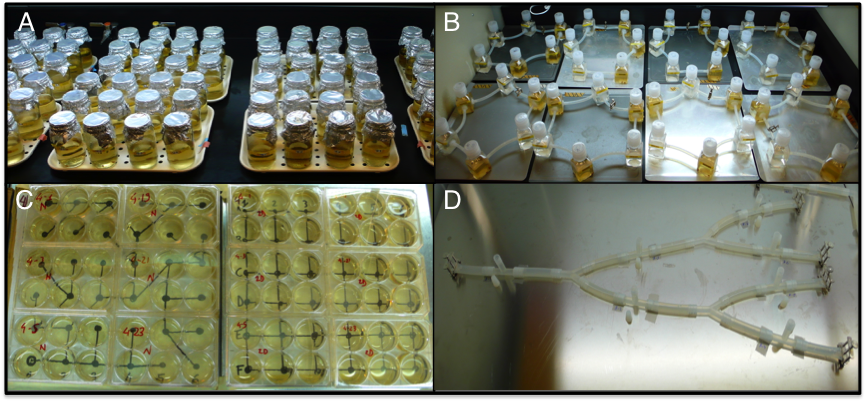

Supplementary information for Altermatt et al. Methods in Ecology and Evolution. DOI: 10.1111/2041-210X.12312

**“Big answers from small worlds: a user's guide for protist microcosms as a model system in ecology and evolution” **

Altermatt F, Fronhofer EA, Garnier A, Giometto A, Hammes F, Klecka J, Legrand D, Mächler E, Massie TM, Pennekamp F, Plebani M, Pontarp M, Schtickzelle N, Thuillier V & Petchey OL

**3.5 Spatial structure**

**Introduction**

A large range of theoretical predictions from meta-population ([Hanski 1999](#_ENREF_15)), meta-community ([Leibold *et al.* 2004](#_ENREF_19)) and meta-ecosystem ecology ([Loreau, Mouquet & Holt 2003](#_ENREF_21)) can be tested using protist microcosm landscapes. Furthermore, the temporal dynamics can be used to assess stability and dynamical behaviour of these systems ([Giometto *et al.* 2014](#_ENREF_14); [Seymour & Altermatt 2014](#_ENREF_23)) as well as evolutionary and eco-evolutionary dynamics ([Fronhofer & Altermatt 2014](#_ENREF_12)). Importantly, microcosm landscapes can be custom built which allows researchers a virtually unlimited flexibility in their experimental design.

The spatial structure can refer both to spatial structure within a patch versus spatial structure between patches. Spatial structure within a patch is often referred to as habitat heterogeneity, and can for example be achieved by adding tiles or glass pearls to microcosms, such that protists can escape/hide from predators. Spatial structure between patches is covered by the metapopulation concept ([Levins 1970](#_ENREF_20)), which explicitly considers the effects of linking local populations through (rare) dispersal events ([Hanski & Gaggiotti 2004](#_ENREF_16)).

Using *Didinium nasutum* and *Paramecium caudatum* as a predator-prey system, already Gause ([1934](#_ENREF_13)) could demonstrate the importance of space for stabilizing predator-prey dynamics. For further examples, including the study of source-sink systems, for instance, see the review by Holyoak & Lawler ([2005](#_ENREF_18)). More recently, diversity patterns in dendritic networks ([Carrara *et al.* 2012](#_ENREF_8); [Seymour & Altermatt 2014](#_ENREF_23)) as well as the predictability of invasion dynamics ([Giometto *et al.* 2014](#_ENREF_14)) or evolutionary processes ([Fronhofer & Altermatt 2014](#_ENREF_12)) during invasions have been studied in protist microcosm landscapes.

Two basic setups exist, one with passive dispersal (dispersal achieved by pipetting small amount of media) and one with active dispersal (patches connected by tubes). While in a passive dispersal setup, connectivity is directly controlled by the experimenter using a predefined pipetting scheme, in an active dispersal setup connectivity patterns are controlled physically by the geometry of the setup, including the number of physical connections between patches and the distances between these patches. Alternatively, instead of manipulating distance, the time a given connection is open can be varied. Both methods are roughly equivalent, yet, varying connection lengths may lead to complications during the landscape building process, as setups may become highly complex.

While pipetting and passive dispersal allow for a high degree of control and environmental conditions, such as gradient in solutes, can be easily maintained, some experiments may require actively dispersing organisms. Active dispersal may be necessary either because the variable of interest is movement or dispersal behaviour ([Fjerdingstad *et al.* 2007](#_ENREF_11); [Fellous *et al.* 2012](#_ENREF_10); [Giometto *et al.* 2014](#_ENREF_14); [Pennekamp *et al.* 2014](#_ENREF_22)) or because potential trade-offs, for instance competition-colonization trade-offs ([Cadotte *et al.* 2006](#_ENREF_7); [Cadotte 2007](#_ENREF_5); [Seymour, Fronhofer & Altermatt 2014](#_ENREF_24)) should not be disrupted.

Experimenters have a nearly unlimited flexibility in designing microcosm landscapes. The simplest landscapes consist of two connected vials (patches). Evidently, more complex landscapes, either linear setups or (large) networks of patches are possible. A central choice the experimenter has to be aware of is the spatial theoretical framework: should the experiment be carried out in a patch-matrix setup or is continuous space more appropriate. This has important implications for comparisons with theory and potential parametrisation and model fitting. A similar decision has to be made for connectivity: is a continuous-time setup, in which connections are never closed, more suitable, or does the experimenter prefer to impose discrete dispersal and reproduction phases? All approaches have been used so far, reaching from discrete-time patch-matrix to continuous-time continuous-space setups.

**Materials**

***Equipment***

Most microcosm landscapes will include building blocks, such as vials, that have already been described elsewhere in detail (see section 2 Methods overview). In order to avoid contamination with fungi or bacteria all materials, including connections between vials (“patches”), must be either autoclavable or previously sterilized and for single use only. As these materials, especially metal and plastic parts, may contain substances that are toxic for protists, all materials have to be thoroughly tested before use. This should happen in a controlled design and involve, for instance, the recording of growth curves to exclude that materials have deleterious effects on growth or on other variables of interest (see section 2.10 time series). Nevertheless, all experiments performed subsequently should include an appropriate number of controls, which reflect the relative amount (and spatial arrangement) of all materials used in the experimental treatments. Previous testing of materials seems especially important if novel techniques such as 3D printing, which imply novel materials are used to build landscapes.

*Equipment for passive dispersal:*

-   Vials to make the patches. Commonly used vials are polypropylene centrifugation tubes (e.g., 20 or 50 mL size), 125-ml Nalgene square Polycarbonate wide-mouth bottle or multiwall plates (e.g., 10 mL wells).

-   Pipettes of varying sizes (10-100 µl, 100-1000 µl, 1-5 mL) to sample as well as to do the dispersal treatment.

*Equipment for active dispersal (discrete landscapes):*

-   Vials to make the patches. Commonly used vials are polypropylene centrifugation tubes (e.g., 20 or 50 mL size) or 125-ml Nalgene square Polycarbonate wide-mouth bottle.

-   Drill to make holes in the vials (holes need to be a bit smaller than outer diameter of silicon tubing, such that it tightly fits without leaking).

-   Connectors to connect the silicon tubing to the vials (not needed when silicon tubing is directly inserted into the hole).

-   Silicon tubing, recommended inner diameter is between 2 to 5 mm.

-   Clamps or stopcocks to close connections.

-   Pipettes of varying sizes (10-100 µl, 100-1000 µl, 1-5 mL) to sample.

*Equipment for active dispersal (continuous landscapes):*

-   Silicon tubing, recommended inner diameter is between 2 to 5 mm.

-   Clamps or stopcocks to close connections.

-   Polypropylene T- and Y-connectors.

-   Silicon stoppers to close the T-connectors.

-   Pipettes of varying sizes (10-100 µl, 100-1000 µl, 1-5 mL) to sample.

***Reagents***

No specific reagents are required.

**Procedure**

*Passive dispersal*

For experiments built on the assumption of passive dispersal (e.g., [Warren 1996](#_ENREF_25); [Cadotte & Fukami 2005](#_ENREF_6); [Altermatt, Schreiber & Holyoak 2011](#_ENREF_3); [Carrara *et al.* 2012](#_ENREF_8)), in which predefined volumes of cultures are pipetted from the patch of origin to the destination patch, any vials can be used, including wellplates, Eppendorf tubes, Petri dishes or Erlenmeyer flasks, to name just a few (Fig. 1A/C). Connectivity patterns can be determined through pipetting schemes. Especially large and highly replicated setups, or experiments including complex pipetting schemes, may be best performed automatically using robots ([for a yeast model system but easily transferable to protists see Bell & Gonzalez 2011](#_ENREF_4)).

In order to avoid long-tailed dispersal, one needs to use a mirror-landscape ([described in detail by Carrara *et al.* 2012](#_ENREF_8)), as otherwise individuals could potentially disperse across more than one patch (distance) in one dispersal step.

1.  Thoroughly mix the culture (also needs to be done in the no-dispersal control).

2.  Sample the proportion of the culture/community that should disperse with a pipette (i.e., “emigration”). For each patch/emigration step, and new and sterile pipette tip must be used.

3.  After emigration, migrants can be stored temporarily in a mirror landscape, or be manipulated, or experience a dispersal related treatment (e.g., mortality). Furthermore, the emigrants can be fractioned into a part that is analysed (e.g., diversity and abundance measured.

4.  Subsequently, distribute the migrants into the patch(es) of immigration.

5.  For the control, the sampled “migrants” are given back into the patch of emigration.

*Active dispersal with discrete landscapes*

Alternatively, experiments may require active dispersal of protists. For active dispersal patches can be continuously connected or only connected during a certain amount of time in order to control connectivity (Fig. 1B). The connections are most often built of silicone tubes (e.g., [Holyoak & Lawler 1996](#_ENREF_17); [Cadotte 2007](#_ENREF_5); [Altermatt & Holyoak 2012](#_ENREF_2); [Fellous *et al.* 2012](#_ENREF_10)). Closing connections can be done using clamps or stopcocks, for example.

1.  Landscapes are built with vials connected by tubing.

2.  Landscapes need to be fixed on a completely horizontal shelf or on a sheet, but can only be moved when all connectors are closed.

3.  Holes for fixing the tubing (or connectors) need to be at same height in all vials, as some species stratify in the vial and thus this can affect dispersal.

4.  Fill the vials with medium, all connectors open, such that the medium can flow across the whole system and fill it. Filling through one opening/vial prevents formation of air bubbles in the tubing (e.g., happens when filled from two vials simultaneously. Air bubbles need to be removed. This can be done with a syringe and sterile needles, whereby air bubbles are sucked out by inserting the needles into the silicon tubing at the place the air bubble formed.

5.  Close all connectors before adding the species. Therefore, remove first the amount of medium that will be replaced by medium containing species. Always make sure that sampling/adding medium happens when all connectors are closed, and make sure that there is a zero net change in medium volume, as otherwise flow among patches occurs.

*Active dispersal with continuous landscapes*

Finally, experiments may be done in continuous landscapes which do not differentiate between matrix and patch. Active dispersal is continuous through a network of silicone tubes (Fig. 1D, [Seymour & Altermatt 2014](#_ENREF_23); [Seymour, Fronhofer & Altermatt 2014](#_ENREF_24)). Closing connections can be done using clamps or stopcocks, for example.

1.  Landscapes are built with silicon tubing only, whereby horizontally installed X-, L- and Y- connectors are used to create different network connectivities.

2.  Make sure that the total amount of connectors, length of tubing and subsequently volume of medium in the landscapes are identical across treatments, and that only the network structure differs.

3.  Use vertically placed T-connectors to insert sampling localities. Silicon stoppers are used to close them.

4.  Landscapes need to be fixed on a completely horizontal shelf or on a sheet, but can only be moved when all openings are closed.

5.  Fill the landscape with medium, all connectors open, such that the medium can flow across the whole system and fill it. Filling through one opening/T-connector prevents formation of air bubbles in the tubing (e.g., happens when filled from two sites simultaneously). Air bubbles need to be removed. This can be done with a syringe and sterile needles, whereby air-bubbles are sucked out by inserting the needles into the silicon tubing at the place the air-bubble formed.

6.  Close all T-connector openings for filling in species or sampling. Therefore, remove first the amount of medium that will be replaced by medium containing species. Always make sure that sampling/adding medium happens when all openings except the one being sampled are closed, and make sure that there is a zero net change in medium volume, as otherwise laminar flow occurs.

Fig. S1. Examples of protist microcosm landscapes. A) 100 mL glass jar patches connected by passive dispersal (pipetting) along a linear landscape ([example from Altermatt *et al.* 2011](#_ENREF_1)). B) 100 mL Nalgene vials connected by tubing (i.e., discrete system with active dispersal) in which active dispersal between high and low nutrient patches was manipulated ([example from Altermatt & Holyoak 2012](#_ENREF_2)). C) 10 mL multi-well plate landscape connected by passive dispersal, comparing dispersal along complex network structures and subsequent effects on diversity (dendritic vs. 2D lattice networks, example from [Carrara *et al.* 2012](#_ENREF_8); [Carrara *et al.* 2014](#_ENREF_9)). D) Continuous landscapes with active dispersal in silicon tubing (example from [Seymour & Altermatt 2014](#_ENREF_23); [Seymour, Fronhofer & Altermatt 2014](#_ENREF_24)).

**Trouble-shooting (Tips and Tricks)**

Two-patch systems, as well as more complex landscapes, may have to be adapted to the specific study organism or set of study organisms. Vial volume may have to be increased for species with very low carrying capacities, for example (see section 2.1). Similarly, for very large species, the diameter of connecting tubes (or the volume pipetted for passive dispersal setups) has to be increased.

Furthermore, different species may stratify characteristically in sufficiently high, unstirred vials. This can be due to oxygen availability, for example. Consequently, the vertical positioning of patch connections can lead to differential dispersal and severe artefacts.

Especially in continuous-time and -space setups the flow of medium has to be exactly controlled and limited to a minimum if the effect is not intended. Often, this can be achieved by constructing microcosm landscapes that are completely air-tight. If landscapes are not moved this reduces the unintended exchange of individuals to a minimum.

**References**

Altermatt, F., Bieger, A., Carrara, F., Rinaldo, A. & Holyoak, M. (2011) Effects of connectivity and recurrent local disturbances on community structure and population density in experimental metacommunities. *PLoS ONE,* **6,** e19525.

Altermatt, F. & Holyoak, M. (2012) Spatial clustering of habitat structure effects patterns of community composition and diversity. *Ecology,* **93,** 1125-1133.

Altermatt, F., Schreiber, S. & Holyoak, M. (2011) Interactive effects of disturbance and dispersal directionality on species richness and composition in metacommunities. *Ecology,* **92,** 859-870.

Bell, G. & Gonzalez, A. (2011) Adaptation and Evolutionary Rescue in Metapopulations Experiencing Environmental Deterioration. *Science,* **332,** 1327-1330.

Cadotte, M.W. (2007) Competition-colonization trade-offs and disturbance effects at multiple scales. *Ecology,* **88,** 823-829.

Cadotte, M.W. & Fukami, T. (2005) Dispersal, spatial scale, and species diversity in a hierarchically structured experimental landscape. *Ecology Letters,* **8,** 548-557.

Cadotte, M.W., Mai, D.V., Jantz, S., Collins, M.D., Keele, M. & Drake, J.A. (2006) On Testing the Competition-Colonization Trade-Off in a Multispecies Assemblage. *The American Naturalist,* **168,** 704-709.

Carrara, F., Altermatt, F., Rodriguez-Iturbe, I. & Rinaldo, A. (2012) Dendritic connectivity controls biodiversity patterns in experimental metacommunities. *Proceedings of the National Academy of Sciences,* **109,** 5761-5766.

Carrara, F., Rinaldo, A., Giometto, A. & Altermatt, F. (2014) Complex interaction of dendritic connectivity and hierarchical patch size on biodiversity in river-like landscapes. *American Naturalist,* **183,** 13-25.

Fellous, S., Duncan, A., Coulon, A.l. & Kaltz, O. (2012) Quorum Sensing and Density-Dependent Dispersal in an Aquatic Model System. *PLoS ONE,* **7,** e48436.

Fjerdingstad, E., Schtickzelle, N., Manhes, P., Gutierrez, A. & Clobert, J. (2007) Evolution of dispersal and life history strategies - *Tetrahymena* ciliates. *BMC Evolutionary Biology,* **7,** 133.

Fronhofer, E.A. & Altermatt, F. (2014) Eco-evolutionary dynamics during experimental range expansions. *Nature Communications,* **in review**.

Gause, G.F. (1934) *The Struggle for Existence*. Dover Publications, Mineaola, N.Y.

Giometto, A., Rinaldo, A., Carrara, F. & Altermatt, F. (2014) Emerging predictable features of replicated biological invasion fronts. *Proceedings of the National Academy of Sciences,* **111,** 297-301.

Hanski, I. (1999) *Metapopulation ecology*. Oxford University Press, Oxford.

Hanski, I. & Gaggiotti, O.E. (2004) Ecology, genetics and evolution of metapopulations. pp. 696. Elsevier Academic Press, Amsterdam.

Holyoak, M. & Lawler, S.P. (1996) The role of dispersal in predator-prey metapopulation dynamics. *Journal of Animal Ecology,* **65,** 640-652.

Holyoak, M. & Lawler, S.P. (2005) The contribution of laboratory experiments on protists to understanding population and metapopulation dynamics. *Advances in ecological research,* **37,** 245-271.

Leibold, M.A., Holyoak, M., Mouquet, N., Amarasekare, P., Chase, J.M., Hoopes, M.F., Holt, R.D., Shurin, J.B., Law, R., Tilman, D., Loreau, M. & Gonzalez, A. (2004) The metacommunity concept: a framework for multi-scale community ecology. *Ecology Letters,* **7,** 601-613.

Levins, R. (1970) Extinction. *Some Mathematical Problems in Biology* (ed. Gerstenhaber), pp. 77-107. American Mathematical Society, Providence.

Loreau, M., Mouquet, N. & Holt, R.D. (2003) Meta-ecosystems: a theoretical framework for a spatial ecosystem ecology. *Ecology Letters,* **6,** 673-679.

Pennekamp, F., Mitchell, K.A., Chaine, A. & Schtickzelle, N. (2014) Dispersal propensity in *Tetrahymena* *thermophila* ciliates—a reaction norm perspective. *Evolution,* **68,** 2319-2330.

Seymour, M. & Altermatt, F. (2014) Active colonization dynamics and diversity patterns are influenced by dendritic network connectivity and species interactions. *Ecology and Evolution,* **4,** 1243-1254.

Seymour, M., Fronhofer, E.A. & Altermatt, F. (2014) Dendritic network structure and dispersal affect temporal dynamics of diversity and species persistence. **in prep.**

Warren, P.H. (1996) Dispersal and destruction in a multiple habitat system: an experimental approach using protist communities. *Oikos,* **77,** 317-325.
